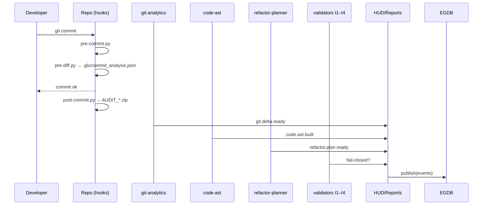

# 06 — CI/Ops i cykl commitu (sekwencja)

```mermaid
sequenceDiagram
  participant Dev as Developer
  participant Git as Repo (hooks)
  participant GA as git-analytics
  participant AST as code-ast
  participant REF as refactor-planner
  participant VAL as validators I1–I4
  participant HUD as HUD/Reports
  participant DB as EGDB

  Dev->>Git: git commit
  Git->>Git: pre-commit.py
  Git->>Git: pre-diff.py → .glx/commit_analysis.json
  Git-->>Dev: commit ok
  Git->>Git: post-commit.py → AUDIT_*.zip

  GA->>HUD: git.delta.ready
  AST->>HUD: code.ast.built
  REF->>HUD: refactor.plan.ready
  VAL->>HUD: fail-closed?
  HUD->>DB: publish(events)
```
