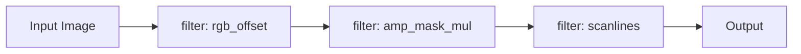

# 05 — Pipelines: Filters / Analysis / Mosaic (Φ/Ψ)

## Filters

%% Mermaid Styles
classDef tile fill:#0b7285,stroke:#083344,color:#fff;
classDef db fill:#4c6ef5,stroke:#233,color:#fff;
classDef guard fill:#e03131,stroke:#300,color:#fff;

## Sprzęg AST ⇄ Mozaika (Φ/Ψ)

**Metryki:** `<!-- @auto:mosaic.metrics -->`
