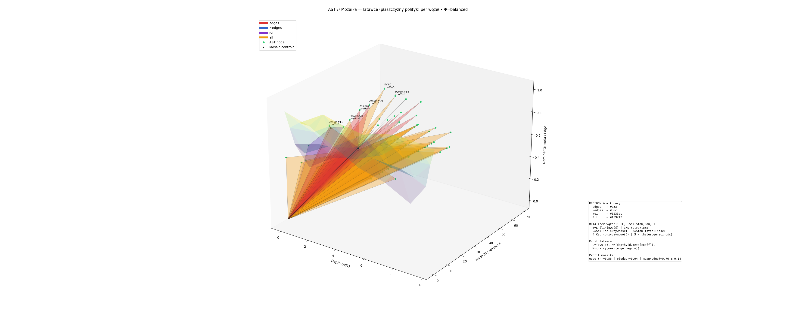
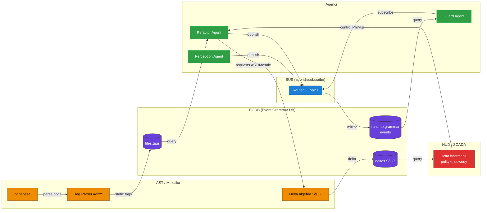
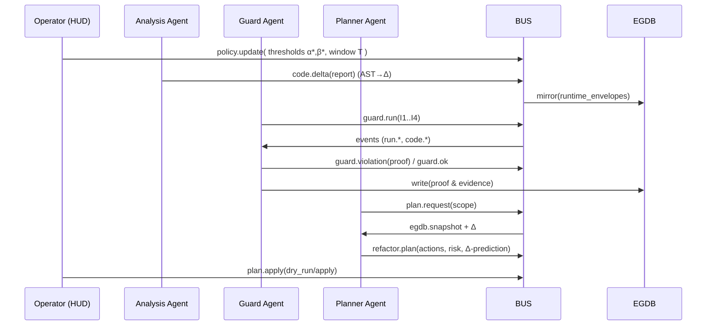

# GlitchLab — **Agent Platform (Human–AI Teaming) (EXPERIMENTAL)**

GlitchLab to **platforma agentowa** dla zespołów Human–AI, która łączy trzy światy w jeden przewidywalny strumień pracy: **AST (struktura kodu)**, **Mozaikę (geometrię zmian Δ)** i **EGDB (Event Grammar DB)**. Zamiast gubić się w logach i domysłach, dostajesz **dowody na żywo**: każdy commit, każde zdarzenie na BUS-ie i każdy plan refaktoryzacji ma ścieżkę przyczynowo-skutkową i metryki. Walidatory działają *fail-closed*, GUI pokazuje Δ-heatmapy i alarmy inwariantów, a trzy węzły szyny (Core/Analysis/GUI) pozwalają skalować się w górę, w bok i — co najważniejsze — w dół, aż do sterowania na poziomie procesu. To nie jest „kolejny framework”, to **język decyzji** dla ludzi i agentów, który sprawia, że zmiany są szybkie, odwracalne i udowadnialne.

Dla liderów technicznych i badaczy AI GlitchLab oznacza koniec kompromisu między eksperymentem a stabilnością. Możesz uruchamiać filtry obrazu, planować refaktoryzacje i trenować agentów na tych samych deltach i inwariantach, które później egzekwuje produkcja. **Jedno źródło prawdy (EGDB)**, **jedna rachunkowość zmian (ΔS/ΔH/ΔZ)**, **jedna szyna** do orkiestracji — a do tego nowoczesny HUD, gotowe hooki Git i katalog dokumentacji, który prowadzi od obrazka architektury do konkretnych poleceń. Jeśli szukasz realnego „Human–AI teaming” zamiast slajdów, **to jest miejsce, w którym prototyp staje się praktyką**.


 <sub>Rys. 1 — Rdzeń GlitchLab: **Agenci** ⇄ **BUS** ⇄ **EGDB** ⇄ **AST/Mozaika** ⇄ **GUI/HUD**. Wspólny rachunek delt **Δ(S/H/Z)** i inwarianty I1–I4 (fail-closed).</sub>

---

## Spis treści

- [GlitchLab — **Agent Platform (Human–AI Teaming) (EXPERIMENTAL)**](#glitchlab--agent-platform-humanai-teaming-experimental)
  - [Spis treści](#spis-treści)
  - [Czym jest GlitchLab jako platforma agentowa](#czym-jest-glitchlab-jako-platforma-agentowa)
  - [Mapa w 60 sekund (agent ⇄ BUS ⇄ EGDB ⇄ Mozaika/AST)](#mapa-w-60-sekund-agent--bus--egdb--mozaikaast)
  - [Human–AI Teaming: pętla operacyjna](#humanai-teaming-pętla-operacyjna)
  - [Dlaczego to działa: matematyka mozaiki dla agentów](#dlaczego-to-działa-matematyka-mozaiki-dla-agentów)
  - [Walidatory inwariantów (I1–I4): bezpieczeństwo i dowody](#walidatory-inwariantów-i1i4-bezpieczeństwo-i-dowody)
  - [Trzy węzły BUS jako minimalny klaster agentów](#trzy-węzły-bus-jako-minimalny-klaster-agentów)
  - [Status: co działa / co w toku (EXPERIMENTAL)](#status-co-działa--co-w-toku-experimental)
  - [Czytaj dalej](#czytaj-dalej)
  - [Model formalny mozaiki: stan i delta](#model-formalny-mozaiki-stan-i-delta)
  - [Inwarianty i aksjomaty (I1–I4)](#inwarianty-i-aksjomaty-i1i4)
  - [Operatory mozaiki i ich Δ](#operatory-mozaiki-i-ich-δ)
  - [Normowanie i metryki: α, β, δ, ε, dystans](#normowanie-i-metryki-α-β-δ-ε-dystans)
  - [Funktory **Φ ⊣ Ψ** (AST ⇄ Mozaika)](#funktory-φ--ψ-ast--mozaika)
  - [EGDB: zdarzenia gramatyczne i projekcja do Δ](#egdb-zdarzenia-gramatyczne-i-projekcja-do-δ)
  - [EGQL: specyfikacja skrócona i przykłady → SQL](#egql-specyfikacja-skrócona-i-przykłady--sql)
  - [Protokoły agentów na BUS (planner/guard/perception)](#protokoły-agentów-na-bus-plannerguardperception)
  - [Dowody, fallback i metahash](#dowody-fallback-i-metahash)
  - [Mini-implementacja: tile \& tematy BUS](#mini-implementacja-tile--tematy-bus)
  - [Czytaj dalej](#czytaj-dalej-1)
  - [Mapa repo i ról](#mapa-repo-i-ról)
  - [Szybka instalacja (Unix/Windows)](#szybka-instalacja-unixwindows)
  - [.env — kanoniczny szablon (ważne inwarianty ścieżek)](#env--kanoniczny-szablon-ważne-inwarianty-ścieżek)
  - [Start **3 węzłów** BUS (Core / Analysis / GUI)](#start-3-węzłów-bus-core--analysis--gui)
  - [EGDB (SQLite minimum) + EGQL](#egdb-sqlite-minimum--egql)
  - [Hooki Git: delta-only i audyty ZIP](#hooki-git-delta-only-i-audyty-zip)
  - [HUD i praca w GUI](#hud-i-praca-w-gui)
  - [Scenariusz „pierwsza pętla” (od commita do refaktora)](#scenariusz-pierwsza-pętla-od-commita-do-refaktora)
  - [CI, walidatory i fallback](#ci-walidatory-i-fallback)
  - [Troubleshooting (najczęstsze potknięcia)](#troubleshooting-najczęstsze-potknięcia)
  - [Dokumentacja szczegółowa (glx\_catalog\_v5)](#dokumentacja-szczegółowa-glx_catalog_v5)
---

## Czym jest GlitchLab jako platforma agentowa

**GlitchLab** to **platforma agentowa AI** do pracy „człowiek ⇄ agenci” nad kodem, multimodalnymi pipeline’ami i decyzjami.
Zamiast monolitu mamy **sieć agentów** mówiących przez **BUS**; każdy agent widzi **ten sam stan świata** dzięki **EGDB** (Event Grammar DB), a **AST/Mozaika** dostarcza *geometrii zmian* – wspólnej „mapy poznawczej” w postaci delt **Δ(S/H/Z)**.

**Rola człowieka**: operator/autor polityk (progi, zasady, cele), który przez GUI/HUD **steruje** agentami (Φ/Ψ), zatwierdza plany i widzi **dowody**, a nie „magiczny wynik”.

---

## Mapa w 60 sekund (agent ⇄ BUS ⇄ EGDB ⇄ Mozaika/AST)

Masz tu działającą wersję (GitHub/Mermaid):

Masz błąd, bo GitHubowa wersja Mermaid nie lubi znaków specjalnych w etykiecie **subgraph** bez cudzysłowów. Daj label w `"` i nie kieruj krawędzi do całego subgrafu.

Poniżej gotowy blok, który powinien się wyrenderować:



* **BUS** — kontrakt zdarzeń i egzekucja polityk (fail-closed).
* **EGDB** — *jedno źródło prawdy* (tagi statyczne + runtime + projekcje Δ).
* **AST/Mozaika** — wspólna rachunkowość zmian **Δ(S/H/Z)** dla kodu i meta-grafu.
* **GUI/HUD** — SCADA gramatyczna: heatmapy Δ, alarmy, sterowanie progami/politykami.

> Rozszerzenie: [Architektura](glx_catalog_v5/docs/GLX_ARCHITEKTURA_KATALOG.md), [BUS](glx_catalog_v5/docs/12_mosaic_metrics.md), [EGDB](glx_catalog_v5/docs/egdb.md).

---

## Human–AI Teaming: pętla operacyjna

1. **Perception Agent** (analiza): parsuje **AST**, zbiera #glx-tagi, liczy **Δ(S/H/Z)** dla zmienionych plików (*delta-only*), uzupełnia **EGDB**.
2. **Guard Agent** (bezpieczeństwo): subskrybuje BUS, sprawdza **inwarianty I1–I4** (np. sekwencja `run.start → run.done|run.error`) i publikuje **dowody + fallback**.
3. **Refactor/Planner Agent** (działanie): odpowiada na polityki i sygnały (hotspoty, coupling), projektuje **plany refaktoryzacji** (Φ/Ψ), generuje łatki.
4. **Operator (Człowiek)**: w **HUD** widzi *dlaczego* (dowody z EGDB), reguluje progi i podejmuje decyzje (apply/dry-run/ignore).

Krótko: **agenci tworzą pętlę decyzyjną**, a człowiek **ustawia kierunek i granice**.

---

## Dlaczego to działa: matematyka mozaiki dla agentów

W GlitchLab agent patrzy na świat przez **wektor stanu**:

$$
v = (S, H, Z)
$$

i **wektor kroku**:

$$
\Delta = (\Delta S,\ \Delta H,\ \Delta Z)
$$

* **S** – struktura (zawieranie, hierarchie, szkielet),
* **H** – mosty/semantyki (def–use, importy, kontrakty),
* **Z** – głębokość (poziom/kubełek abstrakcji).

Z **sum Δ** agent wylicza profil $\alpha = \frac{S}{S+H}$, $\beta = \frac{H}{S+H}$ oraz wybiera „zoom” $Z$ – to wystarcza do:

* klastrów domen (mapa świata),
* priorytetyzacji (β rośnie szybciej niż α → integracje),
* walidacji (**te same inwarianty** dla AST i Mozaiki),
* sterowania **Φ/Ψ** (kontrakcja/ekspansja, bucket-shift).

Dalsze formalizmy (Φ/Ψ, reguły Δ, dowody): [GLX_Mosaika_Matematyka_v5.md](glx_catalog_v5/docs/GLX_Mosaika_Matematyka_v5.md), [12_mosaic_metrics.md](glx_catalog_v5/docs/12_mosaic_metrics.md).

---

## Walidatory inwariantów (I1–I4): bezpieczeństwo i dowody

**Fail-closed** na BUS: wiadomość łamie regułę → **dowód + blokada + fallback**.

* **I1 — typy/kontrakty** (spójność interfejsów),
* **I2 — sekwencje/porządek** (`run.start` → `run.done|error` w oknie T),
* **I3 — lokalność zmian** (scope nie „przecieka”),
* **I4 — monotoniczność celu** (plan nie pogarsza globalnych metryk).

Polityki zapisujemy jako **EGQL** (Event Grammar Query Language), a egzekucję widać w HUD (dowody z **EGDB**).
Szczegóły: [validacja](glx_catalog_v5/docs/validation.md), [egdb](glx_catalog_v5/docs/egdb.md).

---

## Trzy węzły BUS jako minimalny klaster agentów

* **core** — Guard/Policy Agents (I1–I4), egzekucja polis i fallbacki,
* **analysis** — Perception Agent (AST, Δ, projekcja do EGDB),
* **gui** — Operator/HUD (Δ-heatmapy, alarmy, panel polityk i progów).

To „**minimum sensowne**”, by **domknąć pętlę**: zmiana → analiza → walidacja → decyzja → plan → dowód → zastosowanie.

Więcej: [katalog](glx_catalog_v5/docs/index.md), [repozytorium](repo.md), [gui](gui.md).

---

## Status: co działa / co w toku (EXPERIMENTAL)

**Działa**

* Hooki **Git** (`.githooks/`): delta-only, artefakty, ZIP audyty, stabilny UTF-8.
* **Parser #glx** i projekcja do **EGDB** (statyczne + runtime).
* **Guards** na BUS (I1–I4) z **dowodami** i fallbackiem.
* **HUD**: podgląd metryk Δ i alarmów (część kafelków aktywna).

**W toku**

* Domknięcie adjunkcji **Φ ⊣ Ψ** (obustronna projekcja, mniej heurystyk).
* Strojenie wag/progów (docelowo **uczenie** na EGDB).
* Rozbudowa kafelków HUD (diagnostyka, „explain delta”).

---

## Czytaj dalej

* **[Architektura](glx_catalog_v5/docs/GlitchLab_Arch_v5.md)**
* **[Katalog systemu](glx_catalog_v5/docs/GLX_ARCHITEKTURA_KATALOG.md)**
* **[BUS](glx_catalog_v5/docs/bus.md)**
* **[EGDB + EGQL](glx_catalog_v5/docs/egdb.md)**
* **[Walidacja](glx_catalog_v5/docs/validation.md)**
* **[Mozaika/metryki](glx_catalog_v5/docs/12_mosaic_metrics.md)**
* **[GUI](glx_catalog_v5/docs/gui.md)**

---

## Model formalny mozaiki: stan i delta

Mamy **wektor stanu** i **wektor kroku**:

$$
\mathbf{v} = (S,H,Z), \qquad
\Delta = (\Delta S,\, \Delta H,\, \Delta Z)
$$

* **S** — struktura (zawieranie, hierarchie, szkielet);
* **H** — mosty/semantyki (def–use, importy, kontrakty między grupami);
* **Z** — głębokość/„kubełek” abstrakcji.

**Ledger** (księga) to uporządkowany ciąg delt $(\Delta_t)$, z którego liczymy sumy i metryki.  
W AST i w Mozaice stosujemy **ten sam** rachunek $\Delta$ — to klucz do spójności agentów.


> Rozwinięcie: [`GLX_Mosaika_Matematyka_v1.md`](GLX_Mosaika_Matematyka_v1.md), `glx_catalog_v5/docs/12_mosaic_metrics.md`.

---

## Inwarianty i aksjomaty (I1–I4)

1. **I1 — spójność typów i kontraktów**
   Każde ( \Delta H > 0 ) wynikające z kontraktu (topic/schema/API) musi wskazywać istniejącą definicję (dowód w EGDB).
2. **I2 — porządek/sekwencje**
   Dla danej polityki okna czasowego (T):
   `run.start → (run.done ∨ run.error)` w ( \le T ). Brak → blokada + fallback.
3. **I3 — lokalność zmian**
   Operacje w scope nie mogą „przeciekać” poza zadany zakres (dowód: zasięg i ścieżka w EGDB).
4. **I4 — monotoniczność celu**
   Zmiany nie obniżają globalnych metryk celu; jeśli (\beta) ma rosnąć (integracja), plan nie może zmniejszać (\alpha) poniżej progu polityki.

> Polityki i testy inwariantów egzekwuje **Guard Agent** przez BUS; dowody zapisujemy w **EGDB** (sekcja niżej).
> Rozwinięcie: `glx_catalog_v5/docs/validation.md`.

---

## Operatory mozaiki i ich Δ

| Operator                         | Intuicja                               | Δ w Mozaice                                       |
| -------------------------------- | -------------------------------------- | ------------------------------------------------- |
| `contract(K, k)`                 | scalenie (k) węzłów pod centroidem `K` | (\Delta S = -(k-1),\ \Delta H = 0,\ \Delta Z = 0) |
| `expand(K, k)`                   | rozbicie (eksploracja detali)          | (\Delta S = +(k-1),\ 0,\ 0)                       |
| `link(A, B)`                     | most semantyczny / kontrakt            | (\Delta H = +w_{\text{topic/schema}})             |
| `reassign(node, K→K')`           | migracja node między centroidami       | (\Delta S = +1,\ \Delta H = +h_{\text{nowe}},\ 0) |
| `bucket_shift(b→b')`             | zmiana poziomu abstrakcji              | (\Delta Z = (b' - b))                             |
| `plan_node(gen/schema/adapters)` | przygotuj artefakt do wygenerowania    | (\Delta H = +p) (liczba kontraktów/warunków)      |

**AST** ma analogiczne zdarzenia bazowe (Module, Import, Assign, Call, FunctionDef/ClassDef enter/exit) z deterministyczną Δ (patrz: `GLX_Mosaika_Matematyka_v1.md`).

---

## Normowanie i metryki: α, β, δ, ε, dystans

Z sum Δ w jednostce (plik/katalog/kafelek) liczymy:

$$
\alpha=\frac{S}{S+H},\qquad
\beta=\frac{H}{S+H},\qquad
\delta=\text{średnia głębokość}/Z,\qquad
\varepsilon=\text{średnia semantyczna ścieżka}
$$

Prosty dystans między obiektami (A,B):

$$
\begin{aligned}
d(A,B)
&= w_S\cdot\lvert\alpha_A-\alpha_B\rvert \\
&\quad + w_H\cdot\lvert\beta_A-\beta_B\rvert \\
&\quad + w_Z\cdot\lvert Z_A - Z_B\rvert
\end{aligned}
$$


To wystarcza agentom do: klastrów domen, wykrywania **hotspotów integracyjnych** (β rośnie szybciej niż α), czy cięć wizualnych w GUI.

---

## Funktory **Φ ⊣ Ψ** (AST ⇄ Mozaika)

- **Φ (projekcja):** przekształca **ledger AST** do **ledger Mozaiki** (zachowując rząd wielkości: $\lVert \Delta \rVert_{\mathrm{AST}} \approx \lVert \Delta \rVert_{\mathrm{shadow}}$).
- **Ψ (podnoszenie):** generuje kandydaty zmian w AST z planu Mozaiki (kontrakty, linki, bucket-shift).

**Własności (robocze):**

$$
\begin{aligned}
\textbf{Monotoniczność:}\ & \Delta Z \text{ w AST i w Mozaice ma zgodny bilans na ścieżce (I1).} \\
\textbf{Bliskie domknięcie:}\ & \Phi \circ \Psi \approx \mathrm{id}\ \text{(progi dla }\alpha,\beta,Z\text{).} \\
\textbf{Komutacja z }\Delta\text{:}\ & \Phi(\Delta_{\mathrm{AST}}) \approx \Delta_{\mathrm{MOZ}} \ \text{(Import/Call/Define/Use).}
\end{aligned}
$$

> W praktyce **Ψ** jest heurystyczne (do czasu pełnej adjunkcji); dowody i tolerancje zapisujemy w EGDB.

## EGDB: zdarzenia gramatyczne i projekcja do Δ

**EGDB** (Event Grammar DB) scala **#glx-tagi** (statyczne) i **koperty runtime** (BUS) w jedną bazę:

* `files`, `tags` — mapa źródeł i tagów (`glx:topic.publish`, `glx:event=enter_scope:...`, …),
* `runtime_events` — koperty zdarzeń z BUS (topic, ts, payload, tags),
* `grammar_events` — uogólnione zdarzenia gramatyki (enter/use/link/…),
- `deltas` — projekcje do $(\Delta S,\ \Delta H,\ \Delta Z)$ z wagami.

**Reguły Δ** (konfigurowalne, `rules.yaml`): mapują kinds→Δ z wagami domenowymi (np. `schema_contract`, `rpc`, `telemetry`).
**Widoki** (`views.sql`) liczą metryki per plik/kafelek i wykrywają naruszenia inwariantów.

> Rozwinięcie: [Katalog](`glx_catalog_v5/docs/egdb.md`).

---

## EGQL: specyfikacja skrócona i przykłady → SQL

**EGQL** (Event Grammar Query Language) to lekki DSL, który **kompilujemy do SQL** nad EGDB.

**Składnia (skrót):**

```
FIND (events|topics|files|tiles) WHERE cond AND ... ORDER BY field LIMIT n
PATH step >> step [>> step ...] WHERE window<=ms AND NOT EXISTS step
step := TOPIC:glob | KIND:name | TAG:key=value | PORT:kind=name
cond := field op value | ΔS op num | ΔH op num | ΔZ op num
op   := = | != | < | > | <= | >= | ~ (regex/glob)
```

**Przykłady:**

1. **Producenci `run.*`:**

```
FIND topics WHERE TOPIC ~ "run.*" AND KIND = "define"
```

2. **I2: `run.start → run.done|error` w 5s (bez `run.error`):**

```
PATH TOPIC:run.start >> TOPIC:run.done
WHERE window<=5000 AND NOT EXISTS TOPIC:run.error
```

3. **Hotspoty integracji (β > α):**

```
FIND tiles WHERE ΔH > ΔS ORDER BY ΔH DESC LIMIT 20
```

**Kompilacja (schemat):**

```sql
-- PATH A >> B (window) ~ self-join po korelacji i oknie czasowym
SELECT a.id AS a_id, b.id AS b_id
FROM runtime_events a
JOIN runtime_events b
  ON b.ts BETWEEN a.ts AND a.ts + :window
WHERE a.topic GLOB :A AND b.topic GLOB :B
  AND NOT EXISTS (SELECT 1 FROM runtime_events e
                  WHERE e.topic='run.error' AND e.ts BETWEEN a.ts AND b.ts)
```

---

## Protokoły agentów na BUS (planner/guard/perception)



* **Perception/Analysis Agent**: skanuje *delta-only*, publikuje `code.delta`.
* **Guard Agent**: egzekwuje I1–I4, publikuje `guard.violation` z **dowodem**.
* **Planner Agent**: tworzy `refactor.plan` (akcje: rename/extract/split/… + **preview patch**).

Tematy (przykłady): `git.analytics.*`, `code.ast.*`, `refactor.plan.*`, `guard.*`, `run.*`.
Szczegóły kontraktu: `glx_catalog_v5/docs/bus.md`, `contracts.md`.

---

## Dowody, fallback i metahash

**Dowód** to zestaw minimalny:

* ścieżka zdarzeń (PATH) z EGQL → lista `runtime_event.id`,
* kontekst (plik, linie, node_id) i **ledger Δ** (przed/po),
* podpis: **metahash** znormalizowanego JSON (SHA-256), np.:

```json
{
  "path": ["evt:a1", "evt:b9"],
  "window_ms": 4800,
  "scope": {"file":"core/pipeline.py","node":"Pipeline.run"},
  "delta_before": {"S": 12, "H": 7, "Z": 2},
  "delta_after":  {"S": 12, "H": 9, "Z": 2}
}
```

Metahash → `hash(normalize(json))`. Fallback zawiera **plan naprawczy** (np. ponowne uruchomienie etapu, degradacja trybu, ostrzeżenie w HUD).

---

## Mini-implementacja: tile & tematy BUS

**Manifest kafelka** `git_analytics/tile.yaml` (skrót):

```yaml
tile: git-analytics
exposes:
  bus:
    commands: [git.analytics.scan, git.analytics.hotspots, git.analytics.scope,
               code.refactor.plan, code.refactor.apply]
    events:   [git.delta.ready, code.ast.built, refactor.plan.ready]
contracts:
  inputs:  [repo.fs, repo.git, code.ast]
  outputs: [hud.report, patches.git]
policies:
  delta_only: true
  fail_closed: true
params:
  hotspots_window_days: 120
```

> Więcej przykładów: [Kontrakty danych](`glx_catalog_v5/docs/contracts.md`), [BUS](`bus.md`).

---

## Czytaj dalej

* **[Architektura](GlitchLab_Arch_v5.md)**
* **[Katalog systemu](GLX_ARCHITEKTURA_KATALOG.md)** 
* **[BUS](`glx_catalog_v5/docs/bus.md`)**
* **[EGDB + EGQL](`glx_catalog_v5/docs/egdb.md`)**
* **[Walidacja](`glx_catalog_v5/docs/validation.md`)**
* **[Mozaika/metryki](`glx_catalog_v5/docs/12_mosaic_metrics.md`)**
* **[GUI](`glx_catalog_v5/docs/gui.md`)**
* **[Matematyka i Formalizm Mozaiki](`glx_catalog_v5/docs/GLX_Mosaika_Matematyka_v1.md`)**
* **[Kontrakty danych](`glx_catalog_v5/docs/contracts.md`)**
* **[Walidacja](`glx_catalog_v5/docs/validation.md`)**
* **[Metryki i wizualizacje](`glx_catalog_v5/docs/12_mosaic_metrics.md`)**

---


## Mapa repo i ról

```
glitchlab/
├─ core/                 # bus, guards (I1–I4), grammar indexer, plans
├─ analysis/             # git-analytics, mozaika, metryki, policy
├─ gui/                  # HUD, delta-heatmapy, panel inwariantów
├─ .githooks/            # pre/prepare/post-commit (delta-only, audit ZIP)
├─ .glx/                 # runtime: commit_snippet.json, grammar/, state
│  └─ grammar/           # egdb.sqlite, rules.yaml, views.sql
├─ resources/            # img/model.png, przykłady
└─ docs/                 # katalogi referencyjne (lub w glx_catalog_v5.zip)
```

**Role (skrót):**

* **Core**: szyna zdarzeń (BUS), walidatory I1–I4 (fail-closed), subskrybent EGDB.
* **Analysis**: detektory Δ (AST/mozaika), Git range, hotspoty, planner refaktora.
* **GUI**: wgląd w Δ/α/β/δ/ε, alarmy i dowody, sterowanie progami i politykami.

---

## Szybka instalacja (Unix/Windows)

**Wymagania:** Python ≥ 3.9, Git, SQLite (wbudowany), opcjonalnie Docker (dla Postgresa/klastra).

```bash
# 1) zależności
python -m venv .venv && source .venv/bin/activate   # Windows: .venv\Scripts\activate
pip install -r requirements.txt

# 2) aktywuj hooki (z repo-top)
git config core.hooksPath .githooks
```

> **Windows:** wymuszamy UTF-8 (`PYTHONUTF8=1`), a hooki Bash mają wrappery — działają pod Git Bash/WSL/MSYS.
> **Docker/compose:** potrzebny dopiero, gdy chcesz Postgresa zamiast SQLite.

---

## .env — kanoniczny szablon (ważne inwarianty ścieżek)

> **Zasady:**
> • `GLX_ROOT` = *katalog projektu* (często **parent** repo),
> • `GLX_OUT`, `GLX_AUTONOMY_OUT` **muszą** leżeć **wewnątrz** repo (**kotwica: git**),
> • `GLX_RUN=MEAZ` → (M)osaic, (E)xt., (A)utonomy, (Z)IP.

```dotenv
# === GLX CORE ===
GLX_RUN=MEAZ
GLX_PATH_ANCHOR=git

# Katalog projektu (np. parent repo):
GLX_ROOT=..                     # lub absolutna ścieżka projektu

# Paczka (nazwa modułu w GLX_ROOT) — do importów -m:
GLX_PKG=glitchlab

# Wyjścia (W REPO — relatywne do repo-top dzięki kotwicy 'git'):
GLX_OUT=analysis/last
GLX_AUTONOMY_OUT=analysis/last/autonomy

# Mozaika (parametry robocze)
GLX_MOSAIC=default
GLX_ROWS=64
GLX_COLS=64
GLX_EDGE_THR=0.35
GLX_DELTA=0.25
GLX_KAPPA=0.50
GLX_PHI=policy
GLX_POLICY=analysis/policy.json
```

**Najczęstszy błąd:** ustawiasz `GLX_OUT` absolutnie poza repo → hook **odmówi** działania.
Trzymaj `GLX_OUT`/`GLX_AUTONOMY_OUT` **relatywne** (np. `analysis/last`), a `GLX_ROOT` wskaż na projekt.

---

## Start **3 węzłów** BUS (Core / Analysis / GUI)

> Możesz uruchomić wszystko z terminali (albo przez skrypty `tools/…`). Polecenia przykładowe — dostosuj do swoich entry-pointów.

```bash
# 1) Core: BUS + Guard + GrammarIndexer
python -m glitchlab.core.bus               # router + registry
python -m glitchlab.core.guards            # I1–I4 (fail-closed)
python -m glitchlab.core.grammar.indexer   # mirror runtime → EGDB

# 2) Analysis: git-analytics + mozaika
python -m glitchlab.analysis.git_analytics.scan --range HEAD~1..HEAD
python -m glitchlab.mosaic.hybrid_ast_mosaic from-git-dump \
  --mosaic default --rows 64 --cols 64 --edge-thr 0.35 \
  --delta 0.25 --kappa-ab 0.5 --phi policy --policy-file analysis/policy.json \
  --repo-root . --base HEAD~1 --head HEAD --out analysis/last --strict-artifacts

# 3) GUI: HUD + Δ-heatmapy
python -m glitchlab.gui.app
```

**Kontrakty/tematy BUS:** patrz `glx_catalog_v5/docs/bus.md` i `contracts.md` (topics `code.*`, `git.analytics.*`, `guard.*`, `refactor.plan.*`, `run.*`).

---

## EGDB (SQLite minimum) + EGQL

**Minimum (SQLite, bez Dockera):**

```
.glx/grammar/
  egdb.sqlite          # utworzy się przy pierwszym zapisie
  rules.yaml           # mapowanie kinds→Δ i wagi
  views.sql            # widoki α/β/δ/ε i wykrywanie naruszeń
```

**Bootstrap (przykład CLI):**

```bash
python -m glitchlab.core.grammar.bootstrap --db .glx/grammar/egdb.sqlite \
       --rules .glx/grammar/rules.yaml --views .glx/grammar/views.sql
```

**Zapytania EGQL (CLI):**

```bash
# producenci run.*
glx grammar query 'FIND topics WHERE TOPIC ~ "run.*" AND KIND="define"'

# inwariant I2: start→(done|error) w 5s, bez error
glx grammar query 'PATH TOPIC:run.start >> TOPIC:run.done WHERE window<=5000 AND NOT EXISTS TOPIC:run.error'

# hotspoty integracji (β > α)
glx grammar query 'FIND tiles WHERE ΔH > ΔS ORDER BY ΔH DESC LIMIT 20'
```

> Rozwinięcie: `glx_catalog_v5/docs/egdb.md`, `validation.md`.
> **Opcjonalnie Postgres/compose** — gdy rośnie ruch; zostajemy na SQLite na start.

---

## Hooki Git: delta-only i audyty ZIP

> Hooki działają *po wyjęciu z pudełka* po `git config core.hooksPath .githooks`.

* **pre-commit.py** → ładuje `.env`, sanity, *pre-diff* (staged .py → heurystyki AST).
* **prepare-commit-msg** → wstrzykuje snippet do wiadomości, gdy istnieje `.glx/commit_snippet.txt`.
* **post-commit.py** → zgodnie z `GLX_RUN` uruchamia (A)utonomy, (M)ozaikę, (Z)IP (audyt w `backup/AUDIT_*.zip`).

> **Dowód** i ślady: `.glx/commit_analysis.json`, `analysis/logs/commit_*.json`, `backup/AUDIT_*.zip`.

---

## HUD i praca w GUI

* **Delta-heatmapy** (S/H/Z) — przegląd po pliku/katalogu/kafelku.
* **Panel inwariantów** — żywe alarmy I1–I4 z **dowodami** (EGDB → ścieżka PATH, metahash).
* **Sterowanie** — progi ( \alpha^*, \beta^*, Z^*, ) okno (T), wagi (w_S,w_H,w_Z).
* **Fallback** — jeżeli Guard odrzuci wiadomość, GUI pokaże plan naprawczy (np. „powtórz etap”/„degraduj tryb”).

---

## Scenariusz „pierwsza pętla” (od commita do refaktora)

1. **Commit** (zmiana w `core/pipeline.py`) → pre-diff robi AST-skróty, snippet trafia do commit msg.
2. **post-commit** z `GLX_RUN=MEAZ` →
   **M**: mozaika z `from-git-dump`, **A**: autonomia (pakiety/pack.md), **Z**: ZIP audytu.
3. **Analysis Agent** publikuje `code.delta(report)` na BUS.
4. **GrammarIndexer** (Core) zapisuje runtime do EGDB, buduje `grammar_events`+Δ.
5. **Guard Agent** egzekwuje I1–I4; naruszenie? → `guard.violation(proof)` + fallback.
6. **Planner Agent** buduje `refactor.plan` (akcje + preview patch).
7. **GUI**: widzisz Δ-heatmapy, alarmy i **dowody**; klikasz `apply(dry_run)`.

---

## CI, walidatory i fallback

* **CI:**

  * `pre-commit` + szybkie testy syntaktyczne,
  * „zielona linia” = brak naruszeń I1–I4 dla kluczowych polityk EGQL,
  * eksport metryk (α/β/δ/ε) jako artefakty CI.
* **Walidatory (BUS Guard):**
  I1 (kontrakty), I2 (sekwencje), I3 (scope), I4 (monotoniczność celu).
  *Fail-closed* — nie przepuszczamy „cichych degradacji”.
* **Fallback:**
  Plan naprawczy + dowód (PATH, ledger Δ), podpisany **metahash** (SHA-256 znormalizowanego JSON).

---

## Troubleshooting (najczęstsze potknięcia)

**`GLX_OUT ... wychodzi poza repo`**
→ Ustaw `GLX_OUT=analysis/last`, `GLX_AUTONOMY_OUT=analysis/last/autonomy`, `GLX_PATH_ANCHOR=git`.
**`GLX_ROOT ≠ katalog projektu`**
→ `GLX_ROOT` ma wskazywać *projekt* (często parent repo). Zostaw OUT’y relatywnie w repo.
**Hooki nie działają na Windows**
→ Uruchamiaj przez **Git Bash/WSL**, `PYTHONUTF8=1`, a `core.hooksPath` ustawione na `.githooks`.
**Brak plików mozaiki po M**
→ Sprawdź `analysis/policy.json`, `--strict-artifacts` wypisze listę znalezionych plików.
**EGDB „puste”**
→ Upewnij się, że działa **GrammarIndexer** (mirror BUS→EGDB) i że są #glx-tagi w źródłach.

---

## Dokumentacja szczegółowa (glx_catalog_v5)


> Poniższe pliki znajdziesz w archiwum **[`Katalog`](`glx_catalog_v5/docs/`)** lub w repo:

Oto zaktualizowana tabela z linkami w kolumnie **Plik**:

| Sekcja            | Plik                                                       | Opis                                          |
| ----------------- | ---------------------------------------------------------- | --------------------------------------------- |
| Architektura      | [GlitchLab_Arch_v5.md](GlitchLab_Arch_v5.md)               | Ogólny obraz: agenci, BUS, EGDB, mozaika, HUD |
| BUS & kontrakty   | [bus.md](bus.md), [contracts.md](contracts.md)             | Tematy, protokoły, manifesty `tile.yaml`      |
| EGDB & EGQL       | [egdb.md](egdb.md), [validation.md](validation.md)         | Tabele, reguły Δ, DSL, inwarianty I1–I4       |
| Mozaika & metryki | [12_mosaic_metrics.md](12_mosaic_metrics.md)               | α/β/δ/ε, Δ-geometria, wizualizacje            |
| CI & operacje     | [ci_ops.md](ci_ops.md)                                     | Hooki, artefakty, policy w pipeline           |
| GUI               | [gui.md](gui.md)                                           | HUD, Δ-heatmapy, panel inwariantów            |
| Repo              | [repo.md](repo.md), [index.md](index.md)                   | Struktura katalogów, konwencje                |
| Katalog GLX       | [GLX_ARCHITEKTURA_KATALOG.md](GLX_ARCHITEKTURA_KATALOG.md) | Mapowanie modułów/kafelków i ich ról          |

