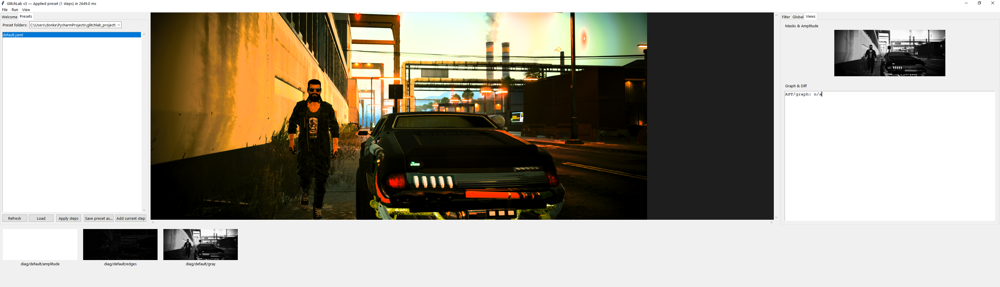
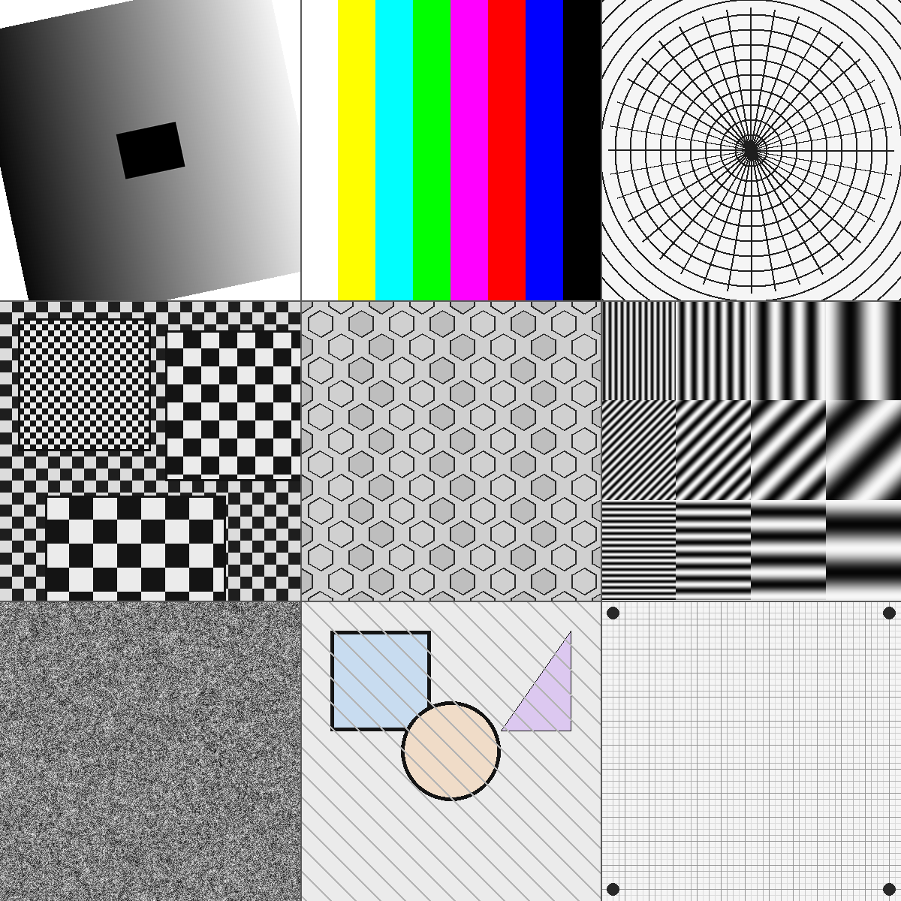

# File: README.md

# GlitchLab — controlled glitch for analysis



GlitchLab to narzędzie badawczo-analityczne do **kontrolowanej generacji artefaktów** w obrazach 2D. Błąd traktujemy jako **sygnał diagnostyczny**: sterując **gdzie** (maski ROI) i **jak mocno** (pole amplitudy) występuje, wyciągamy wnioski o **strukturze danych** i **sprzężeniach między transformacjami**. Całość jest deterministyczna (seed RNG), lekka (NumPy + Pillow), a diagnostyka jest produktem pierwszej klasy — wszystkie kroki odkładają telemetrię do `ctx.cache` (HUD).

> **Teza praktyczna:** artefakt = obserwowalny sygnał. Sterowanie jego lokalizacją i energią umożliwia wnioskowanie o strukturach i relacjach.

---

## Spis treści

* [Cele i założenia](#cele-i-założenia)
* [Szybki start](#szybki-start)
* [Mapa warstw (E2E)](#mapa-warstw-e2e)
* [Meta-struktura mozaikowa i „metametryka”](#meta-struktura-mozaikowa-i-metametryka)
* [Przepływy badań (protokóły)](#przepływy-badań-protokóły)
* [Artefakty a struktury (przykłady)](#artefakty-a-struktury-przykłady)
* [Struktura repo i dokumentacja](#struktura-repo-i-dokumentacja)
* [Licencja i autorzy](#licencja-i-autorzy)

---

## Cele i założenia

* **Deterministyczność:** jeden seed (`ctx.rng`), brak ukrytej losowości.
* **Jedno API filtrów:** `fn(img_u8, ctx, **params) -> np.ndarray` (wew. `float32 [0,1]`, I/O `uint8 RGB`).
* **Diagnostyka jako produkt:** każdy krok emituje kanały HUD (`stage/{i}/…`, `diag/<filter>/…`, `ast/json`, itp.).
* **Lekkość zależności:** Python 3.9+, **NumPy**, **Pillow**, **Tkinter** (GUI). **Bez** SciPy/OpenCV.
* **Spójne nazwy i presety v2:** jedno schema `version/name/amplitude/edge_mask/steps`.

---

## Szybki start

Wymagania: Python 3.9+, NumPy, Pillow, Tkinter.

```bash
pip install -r requirements.txt
python -m glitchlab.gui.main
```

Workflow:

1. **Open image…**
2. Ustaw **Amplitude/Edge/Mask** (prawy panel).
3. Wybierz **Preset** lub **Filter** → **Apply**.
4. Odczytaj diagnostykę w HUD, iteruj parametry.
5. **Save result…**

Do szybkich testów użyj planszy kalibracyjnej:



---

## Mapa warstw (E2E)

* **Core (`glitchlab/core`)** – rejestr filtrów, pipeline (metryki/diff), DAG procesu, mozaika, AST→graf, narzędzia.
* **Analysis (`glitchlab/analysis`)** – metryki (globalne/kafelkowe), diff, FFT/hist, forensyka formatu, eksport DTO.
* **Filters (`glitchlab/filters`)** – moduły z `@register`, spójne parametry (`mask_key|use_amp|clamp`), diagnostyki do HUD.
* **GUI (`glitchlab/gui`)** – stały layout: duży viewer, prawa kolumna „Parameters”, trzy sloty HUD, panele pływające.

Szczegóły:

* [core/ARCHITECTURE.md](core/ARCHITECTURE.md)
* [analysis/ARCHITECTURE.md](analysis/ARCHITECTURE.md)
* [filters/ARCHITECTURE.md](filters/ARCHITECTURE.md)
* [gui/ARCHITECTURE.md](gui/ARCHITECTURE.md)

---

## Meta-struktura mozaikowa i „metametryka”

**Mozaika** jest wspólną soczewką: raster komórek (square/hex) łączący obraz, statystyki blokowe i **strukturę kodu** (AST) w jednej przestrzeni wizualnej.

* `core/mosaic.py` – tworzy mapę etykiet komórek i projektuje metryki blokowe na overlay RGB.
* `core/astmap.py` – parsuje Python AST → lekki graf (węzły: funkcje/klasy; krawędzie: `contains`, `calls`) z metrykami:
  `weight` (rozmiar poddrzewa), `branching` (liczba {If/For/While/Try}), `fan_in/out`. Graf może być rzutowany na mozaikę.

**Metametryka** (warstwa spajająca):

* **Obraz → bloki:** `analysis.metrics.block_stats` → entropia, krawędzie, kontrast per blok.
* **Kod → węzły:** `astmap.ast_to_graph` → `weight/branching/fan_out`.
* **Mapowanie do RGB:** np. `R←branching`, `G←weight`, `B←fan_out` (normalizacja po grafie).
* **HUD:** `stage/{i}/mosaic` + `ast/json` — te same sloty służą do oglądania obrazu i struktury kodu.

> Dzięki temu ta sama „siatka uwagi” służy obserwacji **geometrii obrazu** i **geometrii programu**.

---

## Przepływy badań (protokóły)

* **Test komutacji (A/B):** sprawdza, czy kolejność filtrów ma znaczenie (`Δ = 1 − SSIM(A,B)`).
* **ROI-scan:** zmieniaj maskę ROI i porównuj |artefakt| w/poza ROI → lokalność/nielokalność.
* **Sweep parametrów:** szukaj progów (nagłe zmiany metryk).
* **Seed sweep:** deterministycznie, ale z kontrolą komponentu losowego.

Zobacz: [analysis/ARCHITECTURE.md](analysis/ARCHITECTURE.md) (sekcje: protokoły, metryki, receptury YAML).

---

## Artefakty a struktury (przykłady)

* **Anizotropia (ACW):** *anisotropic\_contour\_warp* przesuwa piksele **wzdłuż** konturów. Stabilna czytelność po kilku iteracjach ⇒ treść leży tangencjalnie do ∇I.
* **Blokowość/kompresja (BMG):** *block\_mosh\_grid* ujawnia rezonanse skali (np. 8/16). Histogram `bmg_dx/dy` i „siatka ducha” na test charcie naprowadzają na rozmiary bloków/skalowanie.
* **Pasma i aliasy:** widoczne w FFT/hist; kierunki odpowiadają dominującej geometrii tekstur.

---

## Struktura repo i dokumentacja

```
glitchlab/
  core/        # registry, pipeline, graph, mosaic, astmap, metrics, utils, roi, symbols
  analysis/    # metrics, diff, spectral, formats, exporters
  filters/     # filtry z @register
  gui/         # aplikacja i panele (HUD, graf, mozaika, parametry)
  presets/     # YAML v2
  screen.png
  glitchlab_testchart_v1.png
```

Każdy dział posiada **ARCHITECTURE.md** (interfejsy/kontrakty) i ten **README** (użycie, praktyki, metapoziom).

---

## Licencja i autorzy

Open Source — D2J3 aka Cha0s (for test and fun).
Wkład: struktury v2, HUD, mozaika/AST, metametryka.

---

---

# File: core/README.md

# GlitchLab Core — runtime, graf procesu i mozaika

> Warstwa **core** rejestruje i uruchamia filtry, normalizuje presety v2, zbiera metryki/diff i buduje DAG procesu oraz artefakty dla HUD/GUI. Zapewnia deterministykę, spójne API i kanały telemetrii.

---

## Kluczowe moduły

* `registry.py` – **jedno źródło prawdy** dla filtrów (`@register`, `get`, `meta`, aliasy).
* `pipeline.py` – normalizacja presetów, `Ctx`, wykonanie kroków, metryki, diff, logi; zapisy do `ctx.cache`.
* `graph.py` – DAG: węzły kroków z deltami metryk; eksport JSON do HUD (`ast/json`).
* `mosaic.py` – siatka square/hex; projekcja metryk blokowych → overlay RGB.
* `astmap.py` – **Python AST → graf** (funkcje/klasy, `calls`/`contains`) + projekcja na mozaikę; `export_ast_json`.
* `metrics/basic.py`, `metrics/compare.py` – entropia, edge density, contrast RMS, PSNR/SSIM.
* `utils.py`, `roi.py`, `symbols.py` – konwersje, maski, symbole → maski.

Szczegóły interfejsów: [ARCHITECTURE.md](ARCHITECTURE.md).

---

## API w pigułce

```python
from glitchlab.core.pipeline import normalize_preset, build_ctx, apply_pipeline
from glitchlab.core.registry import available, get

cfg = normalize_preset({
  "version": 2,
  "seed": 7,
  "amplitude": {"kind":"none","strength":1.0},
  "edge_mask": {"thresh":60,"dilate":0,"ksize":3},
  "steps": [{"name": available()[0], "params": {}}]
})

out = apply_pipeline(img_u8, build_ctx(img_u8, seed=cfg["seed"], cfg=cfg), cfg["steps"])
```

**Filter API v2:** `fn(img_u8, ctx, **params) -> np.ndarray`
Wspólne parametry: `mask_key | use_amp | clamp`. RNG wyłącznie z `ctx.rng`.

---

## Telemetria i HUD

* **Per stage:**
  `stage/{i}/in|out|diff|t_ms`, `stage/{i}/metrics_in|metrics_out|diff_stats`, `stage/{i}/fft_mag|hist`, `stage/{i}/mosaic|mosaic_meta`.
* **Diag per filtr:** `diag/<filter>/…`
* **Global:** `ast/json`, `format/jpg_grid`, `run/id`, `cfg/*`.

> GUI jest **czytnikiem cache** — nie liczy metryk, tylko wyświetla to, co przygotuje core/analysis.

---

## AST → graf → mozaika (metapoziom)

`core/astmap.py` dostarcza:

* `build_ast(source)` – parsowanie Pythona do AST.
* `ast_to_graph(tree)` – węzły `function|class` z metrykami: `weight`, `branching`, `fan_in`, `fan_out`.
* `project_ast_to_mosaic(graph, mosaic)` – przypisanie metryk do komórek (domyślnie `R←branching`, `G←weight`, `B←fan_out`).
* `export_ast_json(graph, ctx, cache_key="ast/json")` – JSON przyjazny HUD.

Przykład projekcji (pseudokod):

```python
from glitchlab.core import mosaic, astmap

tree = astmap.build_ast(open("some_module.py").read())
graph = astmap.ast_to_graph(tree)
mz = mosaic.mosaic_map((H,W), mode="square", cell_px=32)
overlay = astmap.project_ast_to_mosaic(graph, mz)  # uint8 RGB
```

---

## Deterministykę i zakresy typów

* Wejście/wyjście filtrów: `uint8 RGB (H,W,3)`.
* Wnętrze: `float32 [0,1]`.
* **Bez** SciPy/OpenCV.

---

## Status i rozszerzanie

* Dodanie nowej metryki → `metrics/basic.py` (+ opcjonalnie `analysis/metrics.py`).
* Dodanie operatorów (opcjonalny runtime node-style): `artifact.py` / `operator.py`.

---

# File: analysis/README.md

# GlitchLab Analysis — metryki, różnice, pasma

> Warstwa **analysis** dostarcza **miary ilościowe** i wizualizacje, które wykorzystują core i GUI: metryki globalne/kafelkowe, porównania (diff/PSNR/SSIM), widma, forensykę formatu oraz eksport lekkich DTO dla HUD.

---

## Cele i zakres

* Pracujemy na obrazach 2D (RGB/Gray).
* Regulatory: maski ROI (`ctx.masks`) i pole amplitudy (`ctx.amplitude`).
* Obserwowalne: wynik kroku + mapy diagnostyczne (`ctx.cache`).

**Kluczowe pytania badawcze**:

* Czy treść jest **anizotropowa**?
* Czy istnieje **blokowość** (ślad kompresji/skalowania)?
* Czy kolejność filtrów ma znaczenie (**komutacja A/B**)?
* Gdzie dokładnie działa efekt (**lokalność**, ROI)?

---

## Moduły

* `metrics.py` – entropia, gęstość krawędzi, kontrast RMS; warianty blokowe.
* `diff.py` – wizualny diff i statystyki (mean/p95/max, opcjonalnie PSNR).
  Interfejs (skrótem):

  ```python
  from glitchlab.analysis.diff import compute_diff
  out = compute_diff(img_a, img_b, max_side=1024, add_psnr=True)
  # out: {"abs": f32[0,1], "per_channel": (dR,dG,dB), "heatmap", "stats": {...}}
  ```
* `spectral.py` – FFT, ring/sector, histogram.
* `formats.py` – noty forensyczne (np. grid 8×8).
* `exporters.py` – pakowanie telemetrii (bez obrazów) do HUD.

Szczegóły: [ARCHITECTURE.md](ARCHITECTURE.md).

---

## Metametryka (mapy → liczby)

* **Globalne:** SSIM, PSNR, L1/L2, entropia, kontrast RMS.
* **Kafelkowe (mozaika):** statystyki per komórka; projekcja na overlay RGB (`core/mosaic.py`).
* **Specyficzne dla filtrów:** histogram `bmg_dx/dy`, mapa `acw_mag`.

---

## Protokóły badawcze

* **Komutacja A/B**

  ```
  I → F1 → F2 → A
  I → F2 → F1 → B
  Δ = 1−SSIM(A,B)
  ```
* **ROI-scan:** amplitude.kind=mask → |artefakt| w ROI vs. poza.
* **Sweep:** skany 1D/2D parametrów, szukanie progów.
* **Seed sweep:** kontrolowana losowość, wariancja metryk vs. seed.

---

## Praktyka z planszą testową

Użyj `glitchlab_testchart_v1.png`:

* pola jednolite → test nielokalności/„wycieku” efektu,
* szachownice i siatki → rezonanse BMG (dobór `size`),
* wachlarze i pasma → kierunki w FFT.

---

## Replikowalność (checklista)

* obraz wejściowy (nazwa/hasz),
* preset/filtr + parametry (YAML/GUI),
* seed RNG,
* screen HUD (amplitude/maska + 2 mapy diag),
* opis procedury (A/B, ROI, sweep),
* metryki (SSIM/PSNR/entropia/…) i wnioski (progi, relacje).

---

# File: filters/README.md

# GlitchLab Filters — projektowanie i diagnostyka

> **Filtry** są atomami transformacji. Każdy filtr ma **jedno API**, wspólne parametry i obowiązek zapisu diagnostyk do HUD. Filtry nie „wiedzą” o GUI — to core orkiestruje wykonanie i metryki.

---

## API i kontrakty

```python
@register("filter_name", defaults=DEFAULTS, doc=DOC)
def my_filter(img_u8: np.ndarray, ctx: Ctx, **params) -> np.ndarray:
    ...
```

* **Wejście/wyjście:** `uint8 RGB`. Wnętrze: `float32 [0,1]`.
* **Wspólne parametry:**
  `mask_key: str|None` – blend w ROI,
  `use_amp: float|bool` – modulacja siły przez `ctx.amplitude`,
  `clamp: bool` – końcowy `clip` i u8.
* **RNG:** tylko `ctx.rng`.
* **Diagnostyki:** wpisy do `ctx.cache["diag/<filter>/…"]` (min. 1–2 mapy).

---

## Nazewnictwo i aliasy

Rejestr (**core/registry.py**) trzyma kanony i aliasy. Przykłady mapowania:

* `conture_flow|anisotropic_contour_flow → anisotropic_contour_warp`
* `block_mosh → block_mosh_grid`
* `spectral_shaper_lab|spectral_ring → spectral_shaper`
* `perlin_grid|nosh_perlin_grid → noise_perlin_grid`

---

## Przykładowe filtry (skrót)

* **anisotropic\_contour\_warp (ACW):** przesuw wzdłuż konturów; diagnostyki: `acw_mag`, `acw_tx/ty`.
* **block\_mosh\_grid (BMG):** przestawianie/rotacja bloków; diagnostyki: `bmg_select`, `bmg_dx/dy`.

---

## Wzorce implementacyjne

* **Zero pętli per-piksel** (wektoryzacja, operacje blokowe).
* **Parametry poza `defaults`** – ignoruj i loguj (pipeline zapisze ostrzeżenie).
* **Maski/ROI** – dopasuj wymiar (H,W); w razie potrzeby bezpiecznie przeskaluj.

---

## Testy „smoke”

* Wejście: `zeros(48×64)+40` (u8).
* Przypadki: `use_amp=1.0`, `use_amp=0.0`, `mask_key="edge"`.
* Asercje: kształt, dtype, zakres \[0..255], brak wyjątków.

---

## Dokumentacja

* Interfejsy i kanały HUD: [../core/ARCHITECTURE.md](../core/ARCHITECTURE.md)
* Zasady i preset v2: [../ARCHITECTURE.md](../ARCHITECTURE.md)

---

# File: gui/README.md

# GlitchLab GUI — HUD, panele i pływające widoki


> GUI jest **czytnikiem cache**. Renderuje obrazy i telemetrię przygotowaną przez core/analysis. Panele są modularne: dedykowane per filtr lub automatycznie generowane (GenericFormPanel).

---

## Layout

```
┌──────── top-bar ───────┐  File | Preset | Filter | Run | Compare | HUD
├──── left (preview) ────┬──────────── right (Parameters) ────────────────┐
│  ImageCanvas + Overlays│  PanelLoader: Filter Panel / GenericFormPanel  │
│  (toggle full-frame)   │  Amplitude / Edge / Mosaic (stałe sekcje)      │
├──────── bottom HUD (3 sloty) ───────────────────────────────────────────┤
│  Masks & Amplitude   |   Filter Diagnostics    |   Graph & Metrics Log  │
└─────────────────────────────────────────────────────────────────────────┘
```

* **Dock/float:** prawa kolumna i sloty HUD mogą być odpinane do `Toplevel` i dokowane z powrotem.
* **Mini-graf:** rysowany z `ast/json` (DAG procesu lub graf AST).
* **Full-frame:** przełącznik pełnoekranowego podglądu.

---

## Kanały, które GUI rozumie

* `stage/{i}/in|out|diff|t_ms`
* `stage/{i}/metrics_in|metrics_out|diff_stats`
* `stage/{i}/fft_mag|hist`
* `stage/{i}/mosaic|mosaic_meta`
* `diag/<filter>/…`
* `ast/json`, `format/jpg_grid`, `run/id`, `cfg/*`

> GUI **nie liczy** metryk — prezentuje to, co znajdzie po kluczach.

---

## Panele i formularze

* Jeśli istnieje panel dedykowany (`gui/panels/…`), zostanie użyty.
* W przeciwnym razie działa **GenericFormPanel** na podstawie `registry.meta(name)["defaults"]`.
* **PanelContext** dostarcza dynamiczne dane (np. listę `mask_key`).

---

## Skróty i ergonomia

* `Ctrl+O/S` (open/save), `Ctrl+R` (run), `F` (full-frame), `1/2/3` (sloty HUD), `Ctrl+E` (export bundle).
* Ciemny motyw ttk, spójne pady i siatka.
* Pasek statusu: rozmiar obrazu, seed, czas runu, liczba ostrzeżeń.

---

## Mapowanie mozaikowe (w GUI)

* **MosaicView** – pokazuje nakładkę z `stage/{i}/mosaic` i legendę; wspólna skala dla metryk blokowych i projekcji AST (`core/astmap.project_ast_to_mosaic`).
* **GraphView** – DAG procesu lub graf AST (z `ast/json`).

---

## Uruchomienie

```bash
python -m glitchlab.gui.app
```

Szczegóły integracji: [ARCHITECTURE.md](ARCHITECTURE.md) i [../core/ARCHITECTURE.md](../core/ARCHITECTURE.md).

---

## Plansza testowa

Do szybkich weryfikacji użyj `../glitchlab_testchart_v1.png` — wykrywa rezonanse, aliasy i „wycieki” efektów.

---
