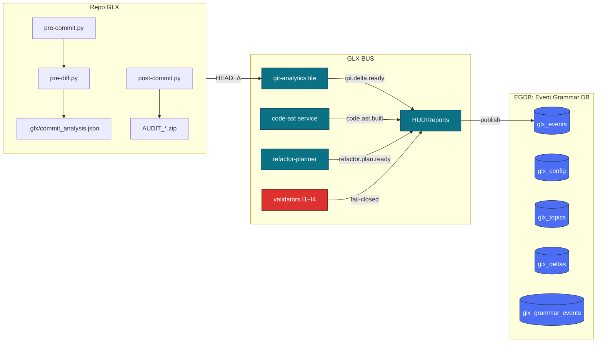
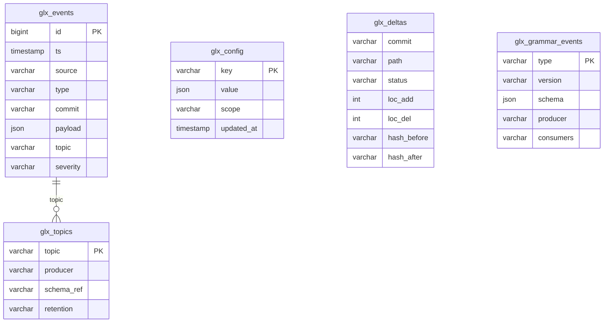
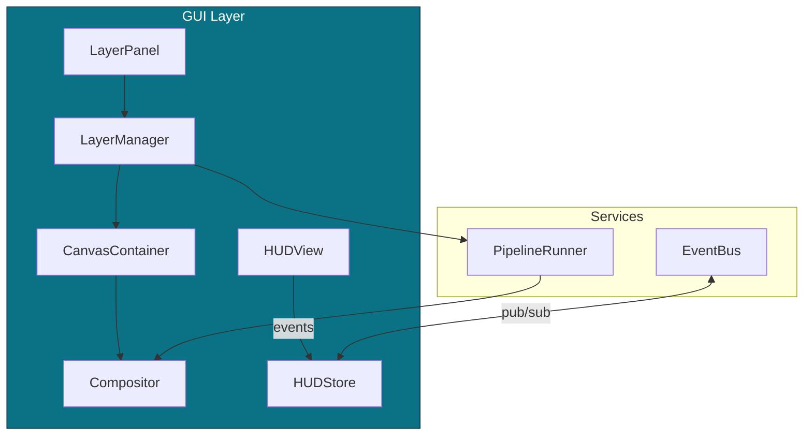
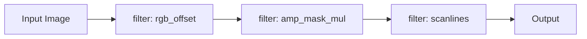
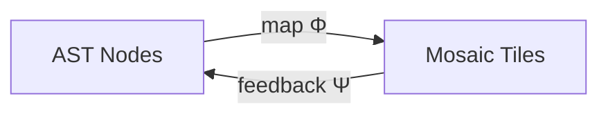
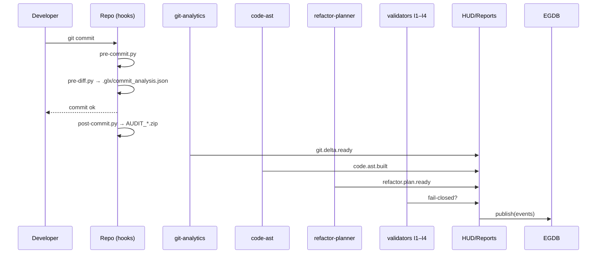

# GLX :: Katalog architektury

> Ten dokument to **hipertekstowy katalog architektury GlitchLab** przygotowany jako **szablon**.  
> **Nie wykonuje** analizy kodu ani załączonych ZIP-ów. Wszystkie sekcje mają **miejsca na automatyczne wypełnienie** (Δ) przez Twoje skrypty GLX.

---

## Spis treści

1. [Mapa systemu (HLD)](#mapa-systemu-hld)
2. [Repozytorium (Repo GLX)](#repozytorium-repo-glx)
   - [pre-commit.py](#pre-commitpy)
   - [pre-diff.py](#pre-diffpy)
   - [.glx/commit_analysis.json](#glxcommitanalysisjson)
   - [post-commit.py](#post-commitpy)
   - [AUDIT_*.zip](#audit_zip)
3. [GLX BUS — tiles, guards, HUD](#glx-bus--tiles-guards-hud)
   - [git-analytics tile](#git-analytics-tile)
   - [code-ast service](#code-ast-service)
   - [refactor-planner](#refactor-planner)
   - [validators I1–I4](#validators-i1i4)
   - [HUD/Reports](#hudreports)
4. [EGDB — Event Grammar DB (ERD + Schemata)](#egdb--event-grammar-db-erd--schemata)
5. [Warstwa GUI (komponenty i przepływy)](#warstwa-gui-komponenty-i-przepływy)
6. [Pipelines: Filters / Analysis / Mosaic (Φ/Ψ)](#pipelines-filters--analysis--mosaic-φψ)
7. [CI/Ops i cykl commitu — sekwencja](#ciops-i-cykl-commitu--sekwencja)
8. [Kontrakty danych (JSON Schema) — szablony](#kontrakty-danych-json-schema--szablony)
9. [Reguły walidacji (I1–I4) — szablon](#reguły-walidacji-i1i4--szablon)
10. [Obserwowalność i metryki (HUD)](#obserwowalność-i-metryki-hud)
11. [Załączniki i tagi automaty](#załączniki-i-tagi-automaty)

---

## Mapa systemu (HLD)

Poniższa mapa jest **kanoniczną** wersją Twojego grafu — rozszerzoną o węzły pomocnicze.  
> Źródło: ręcznie utrzymywany schemat (bez analizy kodu).


**Dowiązania (nawigacja):**  
[Repo GLX](#repozytorium-repo-glx) • [GLX BUS](#glx-bus--tiles-guards-hud) • [EGDB](#egdb--event-grammar-db-erd--schemata)

---

## Repozytorium (Repo GLX)

### `pre-commit.py`
**Rola:** Hak inicjujący proces przygotowania Δ/HEAD.  
**Wejścia:** staged changes.  
**Wyjścia:** wywołanie `pre-diff.py`.  
**Dane:** Δ (A/M/D, loc_add/del), branch, parent.  
**Powiązania:** → [`pre-diff.py`](#pre-diffpy)

**Miejsca na automatyczne wypełnienie (Δ):**
- Δ plików: `<!-- @auto:repo.precommit.delta -->`
- Statystyki LOC: `<!-- @auto:repo.precommit.loc -->`

---

### `pre-diff.py`
**Rola:** Buduje artefakt różnic i metadanych commitu.  
**Wyjścia:** [`/.glx/commit_analysis.json`](#glxcommitanalysisjson).

**Kontrakt (szablon):**
```json
{
  "commit": { "hash": "Δ", "parent": "Δ", "author": "Δ", "ts": "Δ" },
  "delta": { "files": "Δ", "summary": "Δ" },
  "head": { "branch": "Δ" }
}
```

---

### `.glx/commit_analysis.json`
**Rola:** Artefakt repo z danymi Δ/HEAD.  
**Konsumenci:** [`git-analytics tile`](#git-analytics-tile).

**Podgląd (opcjonalny):**
```
<!-- @auto:repo.glx.commit_analysis.preview -->
```

---

### `post-commit.py`
**Rola:** Pakuje audyt w `AUDIT_*.zip`.  
**Wejścia:** HEAD po commit.  
**Wyjścia:** [`AUDIT_*.zip`](#audit_zip).

---

### `AUDIT_*.zip`
**Rola:** Artefakt archiwalny; raporty, logi, zrzuty.  
**Lista zawartości (opcjonalna):**
```
<!-- @auto:repo.audit_zip.contents -->
```

---

## GLX BUS — tiles, guards, HUD

### git-analytics tile
**Rola:** Parsuje `.glx/commit_analysis.json`; emituje `git.delta.ready`.  
**Wejścia:** Δ/HEAD.  
**Wyjścia:** zdarzenie bus.  
**Kontrakt zdarzenia (szablon):**
```json
{
  "type": "git.delta.ready",
  "commit": "Δ",
  "delta": { "files": "Δ" },
  "summary": { "add": "Δ", "del": "Δ" }
}
```

---

### code-ast service
**Rola:** Buduje AST (zakres wg Δ lub całość).  
**Wyjścia:** `code.ast.built`.  
**Kontrakt (szablon):**
```json
{
  "type": "code.ast.built",
  "commit": "Δ",
  "scope": ["Δ"],
  "metrics": { "nodes": "Δ", "functions": "Δ", "classes": "Δ" }
}
```

---

### refactor-planner
**Rola:** Generuje plan refaktorów (na bazie Δ/AST).  
**Wyjścia:** `refactor.plan.ready`.  
**Kontrakt (szablon):**
```json
{
  "type": "refactor.plan.ready",
  "commit": "Δ",
  "items": [{"path":"Δ","action":"Δ","rationale":"Δ"}]
}
```

---

### validators I1–I4
**Rola:** Bramki jakości; publikują `fail-closed` przy naruszeniu.  
**Kontrakt (szablon):**
```json
{
  "type": "fail-closed",
  "commit": "Δ",
  "stage": "I1|I2|I3|I4",
  "errors": [{"code":"Δ","msg":"Δ","path":"Δ"}]
}
```

---

### HUD/Reports
**Rola:** Konsolidacja i publikacja do `glx_events`.  
**Operacja:** `publish` (patrz [EGDB](#egdb--event-grammar-db-erd--schemata)).

---

## EGDB — Event Grammar DB (ERD + Schemata)

**ERD (szablon):**


**Miejsca na schematy (JSON Schema):**
- `glx_events`: `<!-- @auto:egdb.schema.events -->`
- `glx_deltas`: `<!-- @auto:egdb.schema.deltas -->`
- `glx_grammar_events`: `<!-- @auto:egdb.schema.grammar -->`

---

## Warstwa GUI (komponenty i przepływy)

> Nazwy przykładowe zgodne z konwencją GLX (szablon — bez analizy kodu).



**Miejsca na opis komponentów GUI:**
- `<!-- @auto:gui.components -->`

---

## Pipelines: Filters / Analysis / Mosaic (Φ/Ψ)

### Przepływ filtrów (szablon)


### Sprzęg AST ⇄ Mozaika (Φ/Ψ) — koncepcja

**Miejsca na metryki:** `<!-- @auto:mosaic.metrics -->`

---

## CI/Ops i cykl commitu — sekwencja



---

## Kontrakty danych (JSON Schema) — szablony

> Wklej/utrzymuj poniższe schematy jako **źródło prawdy**.  
> Dodaj wersjonowanie w `glx_grammar_events`.

- `git.delta.ready` — `<!-- @auto:schema.git.delta.ready -->`  
- `code.ast.built` — `<!-- @auto:schema.code.ast.built -->`  
- `refactor.plan.ready` — `<!-- @auto:schema.refactor.plan.ready -->`  
- `fail-closed` — `<!-- @auto:schema.fail.closed -->`  
- `publish` — `<!-- @auto:schema.publish -->`  

---

## Reguły walidacji (I1–I4) — szablon

- **I1 — Spójność Δ:** `<!-- @auto:rules.I1 -->`
- **I2 — Syntaktyka/kompilowalność:** `<!-- @auto:rules.I2 -->`
- **I3 — Standardy i konwencje:** `<!-- @auto:rules.I3 -->`
- **I4 — Kontrakty interfejsów:** `<!-- @auto:rules.I4 -->`

> Tryb **fail-closed**: publikuj `fail-closed` przy pierwszym naruszeniu; zatrzymaj przepływ do czasu korekty.

---

## Obserwowalność i metryki (HUD)

Tabela metryk do uzupełnienia przez automaty:

| Warstwa | Metryka | Opis | Miejsce na wypełnienie |
|---|---|---|---|
| Repo | Δ files (A/M/D) | Liczba plików w delcie | <!-- @auto:obs.repo.delta --> |
| Repo | LOC ± | Dodane/usunięte linie | <!-- @auto:obs.repo.loc --> |
| AST | Nodes / Func / Class | Rozmiary AST | <!-- @auto:obs.ast.sizes --> |
| REF | Plan items | Liczba propozycji | <!-- @auto:obs.ref.count --> |
| VAL | I1–I4 pass/fail | Stan bramek | <!-- @auto:obs.val.state --> |
| HUD | T_pub | Czas do publikacji | <!-- @auto:obs.hud.tpub --> |

---

## Załączniki i tagi automaty

- **Wtyczki/tagi dla Twoich skryptów GLX (przykładowe):**
  - `<!-- @auto:... -->` — miejsce wstrzyknięcia danych z audytu/ZIP/analiz.
  - `<!-- @auto:diagram:XYZ -->` — renderuj dodatkowe grafy Mermaid.
  - `<!-- @auto:contract:EVENT -->` — wstaw JSON Schema zdarzenia.

**Instrukcja integracji (pseudo):**
```
glx_doc_inject --file docs/GLX_ARCHITECTURE.md \
  --source /mnt/data/AUDIT_YYYYMMDD.zip \
  --tag @auto:repo.glx.commit_analysis.preview \
  --value "$(jq '.delta | .files' .glx/commit_analysis.json)"
```

---

### Nota końcowa
- Ten katalog jest **template-first**: bez ryzyka pomyłek wynikających z domysłów.  
- Aby go „ożywić”, podłącz swoje encje GLX (ZIP/HASH/MAIL) i wypełnij sekcje oznaczone jako **Δ** lub `@auto:`.
