# GlitchLab — Raport zmian architektury (v5 vs v4)
#### *Część 1: Sakramentalne WTF*

> Zakres tej części: *przegląd kierunków zmian*, **topologia systemu** (BUS × 3 węzły), **mozaika jako rachunek relacji** (Φ/Ψ, I1–I4), **EGDB** jako źródło prawdy, oraz **kontrakt kompatybilności** (GLX\_*, hooki, polityki). Dwie kolejne części rozwiną implementację modułów i plan migracji krok-po-kroku.

## 0) Metodyka porównania (baseline v4 → target v5)

- **Baseline**: analiza obecnej architektury GUI v4 i towarzyszących modułów (core/analysis/mosaic), ze szczególnym naciskiem na manualny przepływ danych oraz brak centralnego repozytorium zdarzeń i reguł. Źródłem referencji jest dokument przeglądowy v4 (GUI, HUD, integracje), który zakłada szkielet eventowy, ale bez pełnej semantyki Φ/Ψ i EGDB. 
- **Target**: **v5** jako system mozaikowy z **funktorami Φ/Ψ**, pseudometriami **d\_AST** i **d\_Φ**, **inwariantami I1–I4**, **EGDB** (Event Grammar DB) i *walidatorami inwariantów w BUS* działającymi „fail‑closed” (odrzucają wiadomość + dowód). Wzorce i formalizmy pochodzą z materiałów o mozaice AST oraz gramatyce zdarzeń. 

**Definicje kluczowe (skrót):**  
- **Φ (projekcja)**: AST → Mozaika (wybór kafli, działanie, obserwable).  
- **Ψ (podnoszenie)**: Mozaika → AST (reguły modyfikacji drzewa w reakcji na dane).  
- **d\_AST**: pseudometryka różnicy między drzewami (topologia, etykiety, parametry).  
- **d\_Φ**: niedopasowanie AST↔Mozaika, sumowane po kaflach/obszarach.  
- **I1–I4**: inwarianty: typy/nośniki; spójność warstw/kontraktów; lokalność; monotoniczność celu. 

---

## 1) Executive Summary (Δ — najważniejsze zmiany)

**✱ NOWE (v5):**  
1. **EGDB (Event Grammar DB)** — persystencja zdarzeń *runtime* i #glx‑tagów statycznych, z EGQL i widokami Δ(S/H/Z). Single source of truth dla audytu, inspekcji i walidacji.
2. **Walidatory Inwariantów na BUS** — hooki „fail‑closed”: węzeł odrzuca ramkę, jeśli łamie I1–I4, dołączając *dowód* (ścieżkę, regułę, Δ). Zasady zakodowane w `rules.yaml` (Δ‑mapy).
3. **Mozaika jako rachunek relacji** — pierwszoplanowa rola mozaiki (kafle, warstwy, selektory, adjacency), formalnie sprzęgnięta z AST przez Φ/Ψ i metryki d\_Φ/d\_AST.
4. **3‑węzłowy BUS startowy** — `gui`, `core+analysis`, `egdb-indexer` na wspólnej szynie z kontraktami (topics, schemat, polityki).  
5. **Git‑analytics tile** + **hooki GLX** — standard ścieżek/ENV oraz delta‑only audyt S/H/Z; zasady kompatybilności GLX\_* i GLX\_RUN. 

**Δ ZMIANY:**  
- **GUI/HUD**: z „panelu operacyjnego” do *SCADA gramatycznej* — interfejs pokazuje Δ i inwarianty, nie tylko logi. Wizualizacje mozaiki jako warstwy semantyczne.  
- **Core/Analysis**: dodane kontrakty Φ/Ψ, kolejki asynchroniczne, raporty metryk (PSNR/SSIM/SMV) zszyte z mozaiką i EGDB.

**⌀ DEPRECJACJE (docelowo):**  
- Ad‑hoc logi bez semantyki Δ — zastąpione zdarzeniami gramatyki z wagami i widokami.

---

## 2) Topologia docelowa (v5) — **BUS × 3 węzły**

```
          ┌──────────┐      git.delta.*, code.ast.*, hud.*
GUI  ◀───▶│   BUS    │◀──── telemetry/metrics + refactor.plan.*
          └──────────┘
             ▲    ▲
    egdb-indexer   core+analysis
  (subscribe + ETL)   (compute + Φ/Ψ)
```

**Rola węzłów:**  
- **GUI** — sterowanie i SCADA gramatyczna (HUD mozaiki, Δ, I1–I4, dowody). Baseline v4 ma już fundamenty HUD; w v5 rozszerzamy o warstwy mozaiki i Δ‑metryki z EGDB.   
- **core+analysis** — wykonanie pipeline, obliczanie metryk, **projekcja Φ** i **podnoszenie Ψ** oraz publikacja zdarzeń `code.ast.built`, `git.delta.ready`, `refactor.plan.ready`.   
- **egdb-indexer** — słucha busa, materializuje zdarzenia i #tagi do **EGDB** (SQLite/Postgres), uruchamia **walidatory** i wystawia widoki EGQL. 

**Zasady kanałów:** kontrola (schematy, reguły, polityki) rozdzielona od danych (artefakty, metryki) — minimalizacja blast radius i ułatwione podpisy polityk. 

---

## 3) Mozaika jako porządek relacji (nie metryka)

**Założenie projektowe:** *mozaika faktoryzuje relacje* — wstawienie obiektu „między 1, a, 2” przemieszcza „2” do pozycji „trzeciej”, **bez zrywania relacji**; operujemy na odcinkach/topologii, nie na bezwzględnych metrykach. Konsekwencje architektoniczne:

1. **Selekcja i działanie lokalne** — każde działanie jest wyrażone jako `(Sel, Act, Obs)` per kafelek/region; brak efektów ubocznych poza nośnikiem (I1).   
2. **Spójność warstw** — operacje dodające nieciągłość muszą ją kompensować (np. feathering mask) w tym samym planie (I2).   
3. **Lokalność zmian** — Ψ nie „wylewa się” poza wybrany zakres; decyzje warunkowe i pętle po skali stają się lokalnymi grafami w mozaice (I3).   
4. **Monotoniczność celu** — plan nie może pogarszać globalnych KPI (np. SSIM/SMV); koszt **𝒥** łączy d\_AST, d\_Φ i stratę zadaniową. 

**Formalizmy (stosowane w v5):**  
- **d\_AST(G,H)** — ważona suma różnic topologii/etykiet/parametrów; służy do oceny zgodności planu z referencją.   
- **d\_Φ(G,M)** — suma niedopasowań planu do danych per kafel; podstawowy sygnał dla Ψ. 

**Minimalne API (kierunek implementacji):** `core.mosaic.build_tiles`, `compute_features`, `hud.mosaic.render`, `core.agent.{phi,psi,plan}` — konsekwentnie używane przez `core+analysis` i GUI. 

---

## 4) EGDB — **Event Grammar DB** jako źródło prawdy

**Po co?** Spina trzy strumienie: (1) #glx‑tagi w źródłach, (2) koperty runtime z BUS, (3) manifesty `tile.yaml`. Pozwala wykonywać zapytania **EGQL**, wykrywać naruszenia i prezentować **dowody** w HUD. 

**Proponowana lokalizacja i artefakty:**

```
.glx/
  grammar/
    egdb.sqlite
    rules.yaml     # mapowanie kind→Δ, wagi, progi I1–I4
    views.sql      # widoki α/β/Δ, naruszenia i ścieżki dowodowe
```

**Model danych (skrót):**
- `files(tags)` — źródła i #glx‑tagi (module, path, sha, tile).  
- `runtime_events` — koperty z busa (topic, ts, payload, tags, violations).  
- `grammar_events` — uogólnione akty gramatyki (`enter_scope|define|use|link|…`).  
- `deltas` — projekcja do Δ(S/H/Z) z wagami/uzasadnieniem. 

**Reguły Δ i wagi:** w `rules.yaml` — domyślne mapowanie *kind → Δ*, z kategoriami (import, contract, rpc, telemetry) i współczynnikami ważenia. Walidatory używają tych samych reguł. 

**Przykład (EGQL — zapytania po naruszenia I2/I3):**

```sql
-- płaty o nieciągłych brzegach po operacjach (I2 break)
SELECT ge.file_path, ge.line, d.dS, d.dH, d.dZ, ge.meta_json
FROM grammar_events ge
JOIN deltas d ON d.ref_ge = ge.id
WHERE ge.kind IN ('define','use') AND json_extract(meta_json, '$.layer')='mask'
  AND EXISTS (
    SELECT 1 FROM views_layer_discontinuity v
    WHERE v.file_path = ge.file_path AND v.line = ge.line AND v.eps > 0.05
  )
ORDER BY ge.ts DESC;
```

---

## 5) Walidatory inwariantów **na BUS** (fail‑closed)

**Cel:** ochrona porządku ontologicznego **w czasie rzeczywistym**. Każdy węzeł BUS ma adapter walidujący **I1–I4**. Zasada: *jeśli naruszenie → DROP + Dowód + Alarm (do HUD/EGDB).* Zasady spójne z gramatyką zdarzeń i `rules.yaml`. 

**Mechanika (kontrakt):**  
- **Wejście**: koperta `{topic, schema, payload, tags}`.  
- **Sprawdzenia**: `check_I1..I4(payload, context) → ok|violation{kind,proof}`.  
- **Wyjście**: `ack` *lub* `reject{proof}` + `bus.event('glx.violation', …)`.  
- **Proof**: ścieżka AST/mozaika, Δ, wagi, reguła, identyfikatory kafli/regionów.

**Przykładowe reguły (z rules.yaml):**

```yaml
defaults:
  enter_scope:   { AST: [1,1,1], MOZ: [1,0,0] }
  exit_scope:    { AST: [0,0,-1], MOZ: [0,0,0] }
  define:        { AST: [0,1,0],  MOZ: [0,1,0] }
  link:          { AST: [0,1,0],  MOZ: [0,1,0] }
  bucket_jump:   { AST: [0,0,ΔZ], MOZ: [0,0,ΔZ] }
  reassign:      { AST: [1,h,0],  MOZ: [1,h,0] }
```

> *Uwagi:* kanały **kontroli** i **danych** są rozdzielone; polityki podpisane i wersjonowane; brak pojedynczego punktu awarii semantycznej. 

---

## 6) Kontrakt kompatybilności i porządek środowisk (GLX\_*)

Aby migracja była łagodna, obowiązuje **konwencja GLX\_*** i **GLX\_RUN** (zachowana wsteczna zgodność; priorytety przełączników; ścieżki względne względem GLX\_ROOT). Pozwala to jednym ruchem uporządkować hooki i artefakty (OUT/ZIP/Autonomy). 

**Minimalne wymagania środowiskowe (w v5):**
- `GLX_ROOT` = korzeń repo; `GLX_PKG` = nazwa pakietu (importowalna).  
- `GLX_OUT`, `GLX_AUTONOMY_OUT` — **wewnątrz repo** (stabilny backup/ZIP).  
- `GLX_RUN` — `A|M|E|Z` (kanoniczna kolejność), z sanity: `Z` wymaga `A` lub `M`. 

---

## 7) Zmiany modułowe (przekrój, Part 1)

### 7.1 GUI/HUD (Δ względem v4)
- **Było (v4)**: panelowe GUI z HUD, podstawowa telemetria i manualna kontrola przepływu.   
- **Jest/Cel (v5)**: **SCADA gramatyczna** — widoki warstw mozaiki (edge/ssim/roi), nakładka Δ(S/H/Z), alarmy inwariantów z **EGDB** (dowody), sterowanie planem (Φ/Ψ) z GUI. 

### 7.2 core+analysis
- **Było**: wykonanie pipeline + metryki, brak jednolitej semantyki mozaiki.  
- **Jest/Cel**: dodane **Φ/Ψ** oraz eksport AST/Δ do BUS; metryki jakości/ekonomiczne (SMV/EVI) ze spójnikami decyzyjnymi (gates). 

### 7.3 egdb-indexer
- **NOWE**: ETL z busa + parser #glx‑tagów → **egdb.sqlite** + **views.sql**; proces walidacji (I1–I4) i alarmy `glx.violation.*`. 

---

## 8) Plan „pierwszej iteracji” (wspólne dla 3 węzłów)

1. **Zdefiniuj kontrakty BUS** (topics, schematy, polityki wersjonowane).  
2. **Utwórz EGDB** (schema + rules + views) i **egdb-indexer**.   
3. **W core+analysis**: wprowadź **Φ** (projekcja) i eksport warstw mozaiki; wprowadź podstawowe **Ψ** (adaptacje parametrów, pętle po skali).   
4. **W GUI**: HUD mozaiki (render + Δ overlay) + panel inwariantów (I1–I4) + „dowody” z EGDB.   
5. **Walidatory BUS**: adaptery fail‑closed, event `glx.violation` z *proof payload*. 

---

## 9) Wskaźniki sukcesu(milestep @1)

- **Obserwowalność**: p95/p99 czasu/SMV/EVI dostępne w HUD; korelacja decyzji z Δ(S/H/Z).   
- **Spójność**: brak naruszeń I1–I4 w ścieżkach krytycznych (dowody=0 na czerwono).   
- **Audyt**: każde zdarzenie i tag dostępne w EGDB/EGQL (wersjonowane reguły). 

---
#### *Część 2: BUS, kontrakty `tile.yaml`, schematy payloadów, akcje Ψ, walidatory I1–I4 i plan migracji*

> Zakres tej części: *przegląd kierunków zmian*, **poszerzenie zakresu (BUS+EGDB+Mozaika) oraz doprecyzowaniem kontraktów i dowodów. Zakładamy model **AST⇄Mozaika** z funktorami **Φ/Ψ**, **faktoryzację relacji** (mozaika **nie** jest metryką), oraz **fail‑closed** walidatory inwariantów I1–I4 w BUS.

## 0. Cel tej części

1) Zdefiniować **interfejsy BUS** i topologię **3 węzłów** z routowaniem tematów i korelacją zdarzeń.  
2) Ustalić **kontrakty** w plikach `tile.yaml` oraz **schematy payloadów** (JSON Schema / kształty).  
3) Zbudować **katalog akcji Ψ** (refaktoryzacje/transformacje) z pre/post‑warunkami i dowodami EGDB.  
4) Zaprojektować **walidatory I1–I4** jako hooki BUS (fail‑closed, z dowodem i ścieżką audytu).  
5) Zaplanować **migrację v4→v5** bez przestoju (dual‑publish, stopniowa deprecjacja).

---

## 1. Topologia BUS (3 węzły) i przestrzenie tematów

### 1.1 Węzły (logiczne)

- **BUS‑A (Core/Orchestrator)** — tematy `core.*`, `egdb.*`, koordynacja zadań i walidacja globalna.  
- **BUS‑B (Analysis/Mozaika)** — tematy `git.analytics.*`, `code.ast.*`, `code.refactor.*`; integruje AST⇄Mozaikę.  
- **BUS‑C (HUD/GUI/Telemetry)** — tematy `hud.*`, `core.metrics.*`, publikacja raportów i HUD.

> *Rola mostów:* A↔B: kontrola porządku i inwariantów; B↔C: publikacja wyników; C→A: operacje użytkownika.  
> *Priorytety QoS:* A (najwyższy, transakcyjny); B (przetwarzanie „ciągłe” z kolejkami); C (fan‑out do GUI).

### 1.2 Przestrzenie tematów (prefiksy)

- `git.analytics.*`: skan zakresów, diff mapy, hotspoty, coupling temporalny.  
- `code.ast.*`: budowa AST, mapowania linii→węzły, metryki S/H/Z/complexity.  
- `code.refactor.*`: plany i zastosowania akcji Ψ, patchsety, wyniki testów.  
- `core.stage.*`: fazowanie pipeline (pre/post commit/push/run).  
- `core.metrics.*`: wskaźniki jakości (przed/po) i budżety regresji.  
- `hud.*`: raporty HUD, snapshoty, powiadomienia.  
- `egdb.*`: rejestry gramatyki zdarzeń (EGQL, reguły Δ, dowody, naruszenia).

### 1.3 Idempotencja i korelacja

- **`correlation_id`** (GUID, dziedziczony), **`causation_id`** (źródło), **`idempotency_key`** (komenda→wynik).  
- **Semantyka dostarczenia:** *at‑least‑once* + deduplikacja po `idempotency_key` w EGDB.  
- **Replays:** `egdb.replay {from_ts|from_event_id}` — zgodny z I4 (nie psujemy budżetów).

---

## 2. BUS API — komendy i zdarzenia (request‑reply + publish/subscribe)

### 2.1 Komendy (request‑reply)

```yaml
git.analytics.scan:
  args: { range?: string, after_sha?: string, branch?: string, path?: string }
  reply: git.delta.ready

git.analytics.hotspots:
  args: { window_days: int }
  reply: git.hotspots.ready

git.analytics.scope:
  args: { file?: path, func?: string, node_id?: string }
  reply: git.scope.ready

code.refactor.plan:
  args: { strategy: string, scope: object, constraints?: object }
  reply: refactor.plan.ready

code.refactor.apply:
  args: { plan_id: string, dry_run?: boolean }
  reply: refactor.apply.done
```

### 2.2 Zdarzenia (publish)

- `git.delta.ready { sha_from, sha_to, changed_files[], hunks[], churn, coupling[] }`  
- `code.ast.built { file, ast_hash, nodes[], smells[], complexity }`  
- `refactor.plan.ready { plan_id, actions[], risk_score, impacted_nodes[], invariants_status }`  
- `refactor.apply.done { plan_id, patches[], tests: {passed,failed}, metrics_delta }`  
- `egdb.violation { invariant, ctx, evidence, severity }`  
- `hud.report { kind, scope, widgets[], attachments[] }`

> Każde zdarzenie zawiera: `correlation_id`, `producer`, `ts_utc`, `proof_uri?` (do EGDB), `trace[]`.

---

## 3. Kontrakty kafelków — `tile.yaml` (rozszerzone)

### 3.1 `git_analytics/tile.yaml` (rozszerzenie względem szkicu v4)

```yaml
tile: git-analytics
version: "2.0"
exposes:
  bus:
    commands: [git.analytics.scan, git.analytics.hotspots, git.analytics.scope]
    events:   [git.delta.ready, code.ast.built]
contracts:
  inputs:
    - repo.fs
    - repo.git
    - code.ast
  outputs:
    - hud.report
    - patches.git
policies:
  zero_guessing: true
  delta_only: true
  abort_on_invariant_violation: true
  fail_closed: true
params:
  hotspots_window_days: 120
  risk_threshold: 0.65
  max_batch_refactors: 10
  idempotency_ttl_sec: 86400
  retry_backoff: { min_ms: 200, max_ms: 8000, factor: 2.0, jitter: true }
health:
  liveness:  /health/live
  readiness: /health/ready
  metrics:   /metrics
```

### 3.2 `refactor_engine/tile.yaml`

```yaml
tile: refactor-engine
version: "2.0"
exposes:
  bus:
    commands: [code.refactor.plan, code.refactor.apply]
    events:   [refactor.plan.ready, refactor.apply.done, egdb.violation]
contracts:
  inputs: [git.delta, code.ast, egdb.rules]
  outputs: [patches.git, egdb.proofs, hud.report]
policies:
  respect_invariants: [I1, I2, I3, I4]
  dry_run_default: true
params:
  max_actions_per_plan: 12
  test_cmd: ["pytest","-q"]
  budget_regression:
    complexity: -0.05   # co najmniej -5% (spadek złożoności)
    hotspots: -0.10     # -10% hotspot score
    coupling: -0.10     # -10% coupling temporalny
```

### 3.3 `hud/tile.yaml` (fan‑out)

```yaml
tile: hud
version: "2.0"
exposes:
  bus:
    events: [hud.report]
    commands: []
contracts:
  inputs: [core.metrics, hud.widgets, egdb.reports]
  outputs: []
policies:
  cache_widgets_sec: 30
  dedupe_reports: true
```

---

## 4. Schematy payloadów (JSON Schema / kształty)

> Poniżej minimalne, **walidowane w BUS** (JSON Schema draft‑07).

### 4.1 `ChangedFile` / `Hunk`

```json
{
  "$id": "https://glx/schemas/changed_file.json",
  "type": "object",
  "required": ["path","status","hunks"],
  "properties": {
    "path":   { "type": "string" },
    "status": { "enum": ["A","M","D","R","C"] },
    "hunks":  {
      "type": "array",
      "items": {
        "type": "object",
        "required": ["old_start","old_lines","new_start","new_lines"],
        "properties": {
          "old_start": { "type": "integer", "minimum": 0 },
          "old_lines": { "type": "integer", "minimum": 0 },
          "new_start": { "type": "integer", "minimum": 0 },
          "new_lines": { "type": "integer", "minimum": 0 }
        }
      }
    }
  }
}
```

### 4.2 `NodeImpact`

```json
{
  "$id": "https://glx/schemas/node_impact.json",
  "type": "object",
  "required": ["node_id","kind","span","delta"],
  "properties": {
    "node_id": { "type": "string" },
    "kind":    { "enum": ["func","class","method","module","block"] },
    "func_name": { "type": "string" },
    "span": { "type": "object",
      "required": ["start_line","end_line"],
      "properties": {
        "start_line": { "type": "integer", "minimum": 1 },
        "end_line":   { "type": "integer", "minimum": 1 }
      }
    },
    "delta": { "type": "object",
      "required": ["plus","minus"],
      "properties": {
        "plus":  { "type": "integer", "minimum": 0 },
        "minus": { "type": "integer", "minimum": 0 }
      }
    }
  }
}
```

### 4.3 `RefactorAction`

```json
{
  "$id": "https://glx/schemas/refactor_action.json",
  "type": "object",
  "required": ["type","target","params"],
  "properties": {
    "type":   { "enum": ["rename_symbol","extract_function","inline_function","split_module","introduce_interface","limit_public_surface","deduplicate","parameter_object","break_dependency","stabilize_api"] },
    "target": { "type": "string" },
    "params": { "type": "object" },
    "preview_patch": { "type": "string" }
  }
}
```

---

## 5. Katalog akcji Ψ (refaktoryzacje) z warunkami Φ/Ψ

> Każda akcja Ψ musi **szanować Φ** (projekcję mozaiki na AST) i inwarianty.  
> **Pre**: warunki konieczne (dowód w EGDB). **Post**: gwarancje/delta metryk (dowód w EGDB).

### 5.1 `rename_symbol`

- **Pre:** Unikalność nowej nazwy w danym *scope*, brak konfliktów importów, stabilność API publicznego (I2).  
- **Post:** Brak zmian semantycznych (I1), zaktualizowany *call graph*, patch idempotentny.  
- **Dowód:** `egdb.proof {symbol_map_before, symbol_map_after, collisions: []}`.

### 5.2 `extract_function`

- **Pre:** Wydzielany blok ma domkniętą zależność (I3), brak „wycieków” (I2), testy dostępne.  
- **Post:** Spadek lokalnej złożoności ≥ budżet (I4), stabilny interfejs (I1).  
- **Dowód:** `metrics_delta.complexity <= -X%`, `tests.passed == true`.

### 5.3 `split_module`

- **Pre:** Moduł przekracza próg „rozrostu” (hotspot × złożoność), wykryta relacja do dwóch poddziedzin.  
- **Post:** Zmniejszony *coupling temporalny* i modularność ↑ (I4), warstwy nienaruszone (I2).  
- **Dowód:** porównanie `coupling_before/after`, `imports DAG` bez „mostów‑na‑skrót”.

### 5.4 `introduce_interface`

- **Pre:** Istnieją ≥2 implementacje o wspólnym kontrakcie (wzorzec).  
- **Post:** Ograniczenie ekspozycji symboli publicznych (I2), poprawa testowalności.  
- **Dowód:** `public_surface_delta < 0`, `mockability == improved`.

### 5.5 `break_dependency`

- **Pre:** Krawędź w DAG łamie porządek warstw (I2).  
- **Post:** Krawędź zastąpiona adapterem/portem; egzekucja I2 „zielona”.  
- **Dowód:** `layering_violations == 0` po zmianie.

*(Analogicznie dla pozostałych akcji; pełna tabela w Załączniku A.)*

---

## 6. Walidatory inwariantów I1–I4 (BUS hooki, fail‑closed)

> Walidacja dzieje się **na wejściu BUS‑A/B**. Naruszenie = **odrzucenie wiadomości** + `egdb.violation` z dowodem.

### 6.1 I1 — spójność typów/interfejsów
- **Wejście:** `code.ast.built`, `refactor.plan.ready`, `refactor.apply.done`.  
- **Sprawdzenia:**  
  - Zgodność sygnatur (AST) i użyć (call graph).  
  - Brak „znikniętych” publicznych symboli bez aliasu/adaptera.  
- **Dowód:** różnice mapy symboli (`public_api_map_before/after`) + lista call‑sites.

### 6.2 I2 — spójność warstw/kontraktów
- **Wejście:** `git.delta.ready`, `code.ast.built`.  
- **Sprawdzenia:** import DAG + reguły warstw (`layer.yaml`), brak skrótów „w górę”.  
- **Dowód:** `dag_before/after`, `violations[]` (0 po akcji).

### 6.3 I3 — lokalność zmian
- **Wejście:** `git.scope.ready`, `refactor.plan.ready`.  
- **Sprawdzenia:** Δ obejmuje wyłącznie zadeklarowany *scope* Φ; brak bocznych efektów.  
- **Dowód:** `scope_region`, `delta_regions`, `extraneous_changes == []`.

### 6.4 I4 — monotoniczność metryk celu
- **Wejście:** `refactor.apply.done`, `core.metrics.*`.  
- **Sprawdzenia:** `metrics_delta` spełnia budżety (complexity/hotspot/coupling).  
- **Dowód:** `metrics_before/after`, podpisany budżet polityki.

### 6.5 Implementacja hooków
- **Forma:** pluginy walidatora (rejestr w `bus.validation/`), kolejność: I1→I2→I3→I4.  
- **Semantyka:** **fail‑closed** (odrzucaj), **dowód** do EGDB (`proof_uri`, binarne artefakty → `backup/AUDIT_*.zip`).  
- **Telemetria:** agregaty `validation.rate`, `rejection.by_invariant` (HUD).

---

## 7. EGDB — dowody i zapytania EGQL (operacyjne)

### 7.1 Zapisy dowodów
- `egdb.proofs(event_id, invariant, evidence_uri, hash, created_at)`  
- `egdb.violations(event_id, invariant, ctx, severity, proof_uri)`

### 7.2 Przykłady EGQL (pseudo‑SQL)

```sql
-- Wszystkie naruszenia I2 w ostatnich 24h, z korelacją planów Ψ
SELECT v.event_id, v.ctx->>'file' AS file, p.plan_id
FROM egdb.violations v
LEFT JOIN egdb.proofs p ON p.event_id = v.event_id
WHERE v.invariant = 'I2' AND v.created_at > now() - interval '24 hours';

-- Budżety I4 niespełnione przez akcje split_module
SELECT a.plan_id, m.delta->>'complexity' AS d_complexity
FROM egdb.actions a
JOIN egdb.metrics_delta m ON m.plan_id = a.plan_id
WHERE a.type = 'split_module' AND (m.delta->>'complexity')::numeric > -0.05;
```

---

## 8. Plan migracji v4 → v5 (bez przestoju)

### 8.1 Mapowanie tematów i aliasy
- v4: `analysis.*`, `refactor.*`, `ui.*` → **aliasy** do nowych: `git.analytics.*`, `code.refactor.*`, `hud.*`.  
- **Dual‑publish** przez 2 sprinty: producent publikuje v4+v5, konsumenci przełączani per serwis.

### 8.2 Etapy migracji
1. **E0 — Przygotowanie:** wdrożenie walidatorów jako „observe‑only” (bez odrzucania), EGDB on‑line.  
2. **E1 — Dual‑publish:** tematy v5 równolegle; `tile.yaml` zaktualizowane (bez zmiany logiki).  
3. **E2 — Enforce:** włącz fail‑closed (I1–I4) dla kluczowych ścieżek (plan/apply).  
4. **E3 — Odcięcie v4:** wyłącz aliasy, usuń stary kod odbiorców.  
5. **E4 — Czyszczenie:** migracja raportów HUD na nowe widżety, archiwizacja starych dowodów.

### 8.3 Zmiany kontraktowe (breaking)
- **Wymóg `correlation_id`** (twardy) i `idempotency_key` dla komend.  
- `git.analytics.scan` zawsze zwraca `git.delta.ready` z **pełnym** `changed_files[].hunks[]`.  
- `refactor.apply.done` musi zawierać `metrics_delta` (I4).

---

## 9. Testy kontraktowe, odporność i operacje

### 9.1 Testy kontraktowe
- **Schematy JSON** walidowane w CI (przeciw fixture’om).  
- **Property‑based** (np. generatory Δ/hunków) z asercjami I1–I4.  
- **Fuzzing**: niepoprawne/niepełne zdarzenia → oczekiwane `egdb.violation`.

### 9.2 Odporność
- **Backpressure:** kolejki tematyczne z watermarkami; odrzucanie łagodzone backoffem.  
- **Retry:** wykładniczy z jitterem, *dead‑letter* temat `core.dlq`.  
- **Idempotencja:** klucze w EGDB z TTL; `apply` wielokrotne ⇒ ten sam wynik/patch id.  
- **Observability:** `trace_id`, log strukturalny, liczniki odrzuceń wg inwariantu.

### 9.3 Runbook (SOP)
- **„BURST” diffów:** tymczasowo podnieść `max_batch_refactors`, utrzymać I3/I4.  
- **„HOT LOOP” walidatorów:** profilowanie I1/I2, cache AST, segmentacja DAG.  
- **„REPLAY” zdarzeń:** `egdb.replay` w oknie „read‑only”, bez łamania I4.

---

## 10. Checklist wdrożeniowy (ta część)

- [ ] Węzły BUS A/B/C działają, routing tematów zgodny z mapą.  
- [ ] `tile.yaml` zaktualizowane dla `git-analytics`, `refactor-engine`, `hud`.  
- [ ] Walidatory I1–I4 załadowane, najpierw `observe‑only`, potem **fail‑closed**.  
- [ ] EGDB przyjmuje `proofs/violations`, indeksy działają.  
- [ ] Dual‑publish aktywny, konsumentów przełączamy stopniowo.  
- [ ] Testy kontraktowe i property‑based zielone.  
- [ ] HUD odbiera `hud.report` z metrykami i dowodami (linki `proof_uri`).

---

### Załącznik A — tabela akcji Ψ (skrót)

| Akcja Ψ                | Pre (Φ/I)                                          | Post (I/budżety)                         | Dowód (EGDB)                              |
|------------------------|-----------------------------------------------------|------------------------------------------|-------------------------------------------|
| rename_symbol          | brak kolizji, stabilność API                        | brak zmian semantyki (I1)                | symbol_map Δ, brak collisions             |
| extract_function       | lokalny, domknięty blok (I3)                        | ↓ złożoność ≥ budżet (I4)                | metrics_delta, tests pass                  |
| inline_function        | brak zwiększenia coupling (I4)                      | uproszczenie call graph                  | call_graph Δ                               |
| split_module           | rozrost, dwa podobszary                             | ↓ coupling temporalny (I4), warstwy OK   | coupling Δ, DAG OK                         |
| introduce_interface    | ≥2 implementacje                                   | ↓ public surface (I2)                    | public_surface Δ                           |
| limit_public_surface   | wyciek symboli                                     | interfejsy zawężone (I2)                 | exported_symbols Δ                         |
| deduplicate            | duplikaty kodu                                     | mniejsza entropia modułu (I4)            | clone_map Δ                                |
| parameter_object       | długi parametr                                     | czytelność, stabilny kontrakt (I1)       | signature Δ, tests pass                    |
| break_dependency       | krawędź łamie warstwy (I2)                          | adapter/port, brak łamania (I2)          | dag_violations == 0                        |
| stabilize_api          | fluktuacje API                                     | wersjonowanie/aliasy, stabilność (I1/I2) | api_compat report                          |

---
#### *Część 3: Plan wykonawczy, roadmap, KPI, backlog*

> Ten dokument zamyka tryptyk raportu. Zawiera **plan wdrożeniowy**, **mapy komponentów**, **KPI/SLI/SLO**, **backlog epików** i **procedury operacyjne** dla migracji do architektury v5 (Mozaika AST⇄Δ + EGDB + walidatory BUS). Całość pozostaje zgodna z naszymi inwariantami (I1–I4) i reżimem *delta-only*.

## 0) Streszczenie wykonawcze

- **Cel końcowy (E2E):** jednorodna, „mozaikowa” architektura, w której **kod (AST)**, **geometria zmian (Δ)** i **czasoprzestrzeń zdarzeń (EGDB)** są **wspólnymi źródłami prawdy**, a BUS egzekwuje inwarianty przy **fail‑closed**.
- **Co dostarczamy w v5:** 
  1) **EGDB** (Event Grammar DB) jako rdzeń telemetrii i reguł Δ/EGQL,  
  2) **Walidatory BUS** (I1–I4) na wejściu/wyjściu kafelków,  
  3) **Kafelek `git-analytics`** (Δ repo ↔ AST) z API BUS,  
  4) **Hooki Git** (pre/prepare/post) stabilne i *repo‑local*,
  5) **Ścieżki i konfiguracja** zunifikowane (brak „przecieków” poza repo).

- **Wartość biznesowa:** niższe ryzyko regresji, obserwowalność refaktorów, przyrostowa automatyzacja decyzji (reguły EGQL), mierzalność długu.

---

## 1) Architektura docelowa (Target v5)

### 1.1 Widok logiczny (BUS + Mozaika + EGDB)

```mermaid
flowchart LR
  subgraph Repo [Repo GLX]
    HookPre[pre-commit.py] --> PreDiff[pre-diff.py]
    PreDiff --> GLXglx[.glx/commit_analysis.json]
    HookPost[post-commit.py] --> AuditZIP[AUDIT_*.zip]
  end

  subgraph Bus [GLX BUS]
    GA[git-analytics tile]:::tile
    AST[code-ast service]:::tile
    REF[refactor-planner]:::tile
    VAL[validators I1–I4]:::guard
    HUD[HUD/Reports]:::tile
  end

  subgraph EGDB[EGDB: Event Grammar DB]
    EVT[(glx_events)]:::db
    CFG[(glx_config)]:::db
    TOP[(glx_topics)]:::db
    GDelta[(glx_deltas)]:::db
    GRM[(glx_grammar_events)]:::db
  end

  Repo -->|HEAD, Δ| GA
  GA -->|git.delta.ready| HUD
  AST -->|code.ast.built| HUD
  REF -->|refactor.plan.ready| HUD
  VAL -->|fail-closed| HUD
  HUD -->|publish| EVT

  classDef tile fill:#0b7285,stroke:#083344,color:#fff;
  classDef db fill:#4c6ef5,stroke:#233,color:#fff;
  classDef guard fill:#e03131,stroke:#300,color:#fff;

```



**Kontrakt integracyjny (skrót):**  
- `git.analytics.scan → git.delta.ready` (Δ plików, hunki, churn, coupling),  
- `code.ast.built` (AST hash, metryki, smells),  
- `refactor.plan.ready` (akcje + preview patch),  
- **EGDB** utrwala wszystko; **EGQL** zapewnia zapytania audytowe i reguły.

### 1.2 Inwarianty (egzekwowane na BUS, zapisywane w EGDB)

- **I1 Typy/Nośniki:** interfejsy są zgodne (schemat payload + wersjonowanie).  
- **I2 Warstwy/Kontrakty:** kafelek nie wychodzi poza dozwolone kanały.  
- **I3 Lokalność zmian:** Δ nie „przecieka” poza zadeklarowany scope.  
- **I4 Monotoniczność jakości:** *hotspot score* i coupling nie rosną po planie.

---

## 2) Plan wdrożenia (90 dni, *delta-first*)

> Podejście *rolling upgrade*, żadnych „flag day”. Każda fala kończy się artefaktem audytowym (EGDB snapshot + HUD).

### Fala A (Tydz. 1–3): Stabilizacja hooków i ścieżek
- Ujednolicenie loadera `.env` (repo‑local; brak odwołań poza repo).
- Pre‑/post‑diff: deterministyczne raporty `.glx/*` + append do `docs/DIFF_SUMMARY.md` (idempotentnie).
- Weryfikacja ścieżek `GLX_OUT`, `GLX_AUTONOMY_OUT` **wewnątrz repo** (twarde odmowy).
- **Artefakty:** commit_*.json, AUDIT_*.zip; metryki penetracji hooków.
- **Exit:** 0 krytycznych błędów path/invariants w 10 kolejnych commitach.

### Fala B (Tydz. 4–7): EGDB + walidatory BUS (read‑only → enforce)
- Uruchom EGDB (DDL + views + seed config).  
- Rejestrowanie zdarzeń `git.delta.ready`, `code.ast.built` w trybie **observe**.  
- Walidatory I1–I4 w trybie **warn** (raporty + EGQL dla wyjątków).  
- **Exit:** ≥95% wiadomości przechodzi walidację w trybie `warn` bez błędów schematu.

### Fala C (Tydz. 8–10): `git-analytics` + mapowanie Δ→AST
- Kafelek `git-analytics`: coupling czasowy, churn, hotspots, Δ→AST (Φ/Ψ).  
- Publikacja `refactor.plan.ready` (dry‑run) + HUD diff‑metrics.  
- **Exit:** co najmniej 1 plan z `risk_score ≤ threshold` przechodzi testy w dry‑runie.

### Fala D (Tydz. 11–13): Egzekucja i automatyzacja
- Walidatory I1–I4 przełączone na **fail‑closed** (na tematach krytycznych).  
- `refactor.apply(dry_run)` → testy → kontrolowane `apply` (patches).  
- **Exit:** ≥ X% (ustal) spadek hotspot/coupling na próbie Δ, brak naruszeń I1–I4.

---

## 3) Mapy komponentów i interfejsów

### 3.1 Kafelek `git-analytics` (API BUS)

**Commands:**  
- `git.analytics.scan {range|after_sha|branch|path}` → `git.delta.ready`  
- `git.analytics.hotspots {window_days}`  
- `git.analytics.scope {file|func|node_id}`  
- `code.refactor.plan {strategy, scope, constraints}`  
- `code.refactor.apply {plan_id, dry_run|apply}`

**Events:**  
- `git.delta.ready(sha_from, sha_to, changed_files[], churn, coupling[])`  
- `code.ast.built(file, ast_hash, nodes, complexity, smells[])`  
- `refactor.plan.ready(plan_id, actions[], risk_score, impacted_nodes[], invariants_status)`

**Tile manifest (skrót):**
```yaml
tile: git-analytics
bus:
  commands: [git.analytics.scan, git.analytics.hotspots, git.analytics.scope, code.refactor.plan, code.refactor.apply]
  events:   [git.delta.ready, code.ast.built, refactor.plan.ready]
contracts:
  inputs:  [repo.fs, repo.git, code.ast]
  outputs: [hud.report, patches.git]
policies:
  zero_guessing: true
  delta_only: true
  abort_on_invariant_violation: true
params:
  hotspots_window_days: 120
  risk_threshold: 0.65
  max_batch_refactors: 10
```

### 3.2 Walidatory I1–I4 (guard service)

- **I1 (types):** walidacja schematu (JSON Schema + wersjonowanie topiców).  
- **I2 (layers):** tablica dozwolonych krawędzi BUS (`allowlist` tematów per kafelek).  
- **I3 (locality):** Δ zawarte w scope (plik/func/node) — porównanie z `git.delta.ready`.  
- **I4 (quality):** funkcja celu (hotspot × coupling × complexity) **nie rośnie** po planie.

**Tryby:** `observe` → `warn` → `fail-closed`.  
**Dowód odmowy:** zapis *cause+evidence* w `glx_events` + preview patch w EGDB (jeśli dotyczy).

---

## 4) Ryzyka i mitigacje

| Ryzyko | Wpływ | Sygnał (EGDB/HUD) | Mitigacja |
|---|---|---|---|
| Rozjazd ścieżek/ENV | Brak artefaktów Δ/AST | Spadek `files_processed`, błędy hooków | Twarde walidacje w hookach + testy ścieżek |
| Szum metryk Δ→AST | Fałszywe plany | Wysoka wariancja Φ/Ψ | Uśrednianie okna, filtry outlierów, ręczna akceptacja |
| Zbyt agresywny fail‑closed | Blokada busa | Wzrost `reject_rate` | Faza `warn`, *canary topics*, rollout selektywny |
| Dług w parserach | Niekompletne AST | `ast_missing_rate` | Kolejka parser fixes, fallback heurystyczny + flagi |
| Coupling ukryty | Plan nie przynosi zysku | coupling↑ po `apply` | EGQL kontrole po-fakcie + roll‑back patches |

---

## 5) KPI/SLI/SLO (zasilane z EGDB)

**SLI (pomiar):**
- `delta_coverage = handled_changed_files / all_changed_files`
- `validator_reject_rate = rejected_msgs / all_msgs`
- `refactor_plan_pass_rate = plans_green / plans_total`
- `quality_gain = (hotspot*cplx*cplg)_before / (hotspot*cplx*cplg)_after`
- `audit_zip_freshness = time_to_zip_after_commit`

**SLO (cel roczny, startowo):**
- `delta_coverage ≥ 0.90`, `reject_rate ≤ 0.03`, `quality_gain ≥ 1.15x`

**KPI operacyjne (miesięczne):**
- Liczba **walidowanych** commitów bez naruszeń I1–I4 ≥ 85%,
- Średni czas od `git.analytics.scan` do `refactor.plan.ready` ≤ 3 min,
- Co najmniej 2 „zielone” plany w tygodniu zastosowane na produkcji.

---

## 6) Backlog (Epiki → Stories → Akceptacja)

### E1: EGDB (core)
- **S1:** DDL + indeksy + seed (`glx_config`, `glx_topics`, `glx_events`, `glx_deltas`).  
  *Akceptacja:* `SELECT` z widoków bez błędów; snapshot HUD.
- **S2:** EGQL (parser minim.) + reguły Δ (porządek, coupling, okna czasowe).  
  *Akceptacja:* 5 przykładowych zapytań audytowych.

### E2: Walidatory BUS
- **S1:** `observe` + JSON Schema registry per topic.  
- **S2:** `warn` dla tematów krytycznych.  
- **S3:** `fail-closed` + dowód w EGDB (payload, ślad, przyczyna).

### E3: `git-analytics`
- **S1:** Δ range (merge-base heurystyka) + hunki + blame/churn.  
- **S2:** Δ→AST (Φ projekcja, Ψ wnioskowanie kandydatów refaktoryzacji).  
- **S3:** `refactor.plan.ready` (preview patches), dry‑run testy + HUD.

### E4: Hooki Git + ścieżki
- **S1:** Repo‑local .env (łańcuch przodków) + normalizacja ścieżek do **repo**.  
- **S2:** Deterministyczne AUDIT ZIP + LOGi commitów.  
- **S3:** Idempotentny `prepare-commit-msg` (wstrzyknięcie snippetów).

---

## 7) Procedury operacyjne (SOP)

### 7.1 Deployment
1. Migruj EGDB (DDL → views → seed).  
2. Deploy walidatorów w trybie `observe` (feature flag).  
3. Włączyć `git-analytics` z minimalnym zbiorem topiców.  
4. Po tygodniu stabilności: `warn` → `fail-closed` dla wybranych tematów.

### 7.2 Rollback
- Konfiguracja walidatorów na `observe`, wstrzymanie `refactor.apply`.  
- Rewind schematów topiców (wersjonowanie).  
- Przywrócenie poprzedniego obrazu kafelka.

### 7.3 Testy
- **Contract tests** na payloadach BUS (I1/I2).  
- **Property‑based** na Φ/Ψ (I3/I4).  
- **Canary runs** na wąskim zakresie Δ.

---

## 8) Kryteria akceptacji migracji v5

- EGDB w trybie **prod‑ready**, pełny ślad Δ/AST/planów.  
- Walidatory I1–I4 działają na min. 3 tematach w **fail‑closed** z dowodem.  
- `refactor.plan.ready` generuje ≥1 akcję tygodniowo **z akceptacją testów**.  
- HUD raportuje **spadek** przynajmniej jednej z metryk: hotspot / coupling (X% ustalone).

---

## 9) Załączniki (skrót)

### 9.1 EGQL — przykłady
```sql
-- Zapytanie o naruszenia I2 (warstwy) w ostatnich 24h
SELECT * FROM glx_events e
WHERE e.topic = 'validator.violation.I2'
  AND e.ts >= now() - interval '24 hours';

-- Pliki najczęściej wspólno-zmieniane (temporal coupling) w oknie 30 dni
SELECT file_a, file_b, count(*) AS cochange
FROM glx_deltas
WHERE ts >= now() - interval '30 days'
GROUP BY 1,2
ORDER BY cochange DESC
LIMIT 20;
```

### 9.2 Walidatory — kontrakt minimalny
```yaml
validator:
  mode: [observe|warn|fail-closed]
  topics:
    - name: git.delta.ready
      schema: schema/git.delta.ready-1.json
    - name: code.ast.built
      schema: schema/code.ast.built-1.json
    - name: refactor.plan.ready
      schema: schema/refactor.plan.ready-1.json
  evidence:
    sink: egdb.glx_events
    retain_days: 180
```

### 9.3 Wzorzec `tile.yaml` (pełny w repo)
```yaml
tile: git-analytics
exposes:
  bus:
    commands: [git.analytics.scan, git.analytics.hotspots, git.analytics.scope, code.refactor.plan, code.refactor.apply]
    events:   [git.delta.ready, code.ast.built, refactor.plan.ready]
contracts:
  inputs: [repo.fs, repo.git, code.ast]
  outputs: [hud.report, patches.git]
policies:
  zero_guessing: true
  delta_only: true
  abort_on_invariant_violation: true
```

---

### Wniosek
v5 łączy **mechanikę mozaiki** (Φ/Ψ, Δ) z **gramatyką zdarzeń** (EGDB, EGQL) i **egzekucją inwariantów** (I1–I4) na BUS. Każdy commit to nowy kafelek w spójnej układance — mierzalny, odwracalny, i udokumentowany.

---
#### *Część 4A: Event Grammar DataBase (EGDB)*

> Jedno źródło prawdy o zdarzeniach (runtime i deklaratywnych) z projekcją do **AST** i **Mozaiki**, egzekwujące reguły **Δ(S/H/Z)**, polityki inwariantów (I1–I4) i zapytania **EGQL**.


## 0. Skrót dla decydenta

- **Po co:** Zmierzyć, zweryfikować i udowodnić poprawność przepływów oraz zmian w GLX na podstawie *faktów* (logów runtime + #glx-tagi statyczne).  
- **Co daje:** Zapytania sekwencyjne EGQL (czas) + strukturalne (AST) + mozaikowe (S/H/Z), walidację inwariantów, planowanie refaktoryzacji, audyt zmian i wyskalowane metryki.  
- **Jak działa:** Tag-parser → Grammar-Indexer → Projekcja na `grammar_events` + `deltas` → zapytania EGQL → alarmy i fallback na szynie.  
- **Gdzie leży:** `.glx/grammar/egdb.sqlite` + `rules.yaml` + `views.sql` (wersjonowane wraz z repo).

---

## 1. Zakres i źródła danych

**Wejścia** do EGDB:
1) **#glx:** tagi w komentarzach kodu (`# glx:key=value`) — *statyczna gramatyka*;  
2) **Koperty runtime** z busa (GLXEvent) — *zdarzenia wykonawcze*;  
3) **Manifesty** kafelków `tile.yaml` — *kontrakty usług i portów*.  

**Wyjścia** z EGDB:
- **EGQL** (Event Grammar Query Language) — DSL do kwerend;  
- **Strumienie Δ(S/H/Z)** — projekcje do AST/Mozaiki;  
- **Alarmy inwariantów** (I1–I4) i automatyczne **fallback** (bus).

**Lokalizacja repo:**

```
.glx/
  grammar/
    egdb.sqlite              # główny magazyn (SQLite)
    rules.yaml               # reguły Δ i wagi (wersjonowane)
    views.sql                # widoki pomocnicze (β, α, klastrowanie)
```

---

## 2. Model danych (SQLite + JSONB-like TEXT)

> SQLite jako „czarna skrzynka” z faktami: minimalne sprzężenie, maksymalna przenośność. JSON trzymamy w `TEXT`; dostęp przez funkcje narzędziowe warstwy Python.

### 2.1 Tabela `files` (źródła + #tagi)

```sql
CREATE TABLE IF NOT EXISTS files (
  id INTEGER PRIMARY KEY,
  module TEXT,                 -- 'core', 'gui', 'analysis', 'mosaic', ...
  path TEXT UNIQUE,            -- np. 'gui/services/pipeline_runner.py'
  sha TEXT,                    -- git blob
  tile TEXT,                   -- z tile.yaml, np. 'core'
  extracted_at INTEGER         -- epoch ms
);
CREATE TABLE IF NOT EXISTS tags (
  id INTEGER PRIMARY KEY,
  file_id INTEGER REFERENCES files(id) ON DELETE CASCADE,
  line INTEGER,
  key TEXT,                    -- 'glx:topic.publish'
  value TEXT,                  -- CSV / JSON
  raw TEXT                     -- pełny wiersz komentarza
);
CREATE INDEX IF NOT EXISTS idx_tags_file ON tags(file_id);
```

### 2.2 Tabela `runtime_events` (koperty z busa)

```sql
CREATE TABLE IF NOT EXISTS runtime_events (
  id TEXT PRIMARY KEY,         -- GLXEvent.id
  ts REAL, topic TEXT, plane TEXT, source TEXT,
  schema TEXT, correlation_id TEXT, causation_id TEXT,
  payload_json TEXT,           -- treść zdarzenia
  tags_json TEXT,              -- list[str]
  violations_json TEXT         -- list[str]
);
CREATE INDEX IF NOT EXISTS idx_re_topic_ts ON runtime_events(topic, ts DESC);
```

### 2.3 Tabela `grammar_events` (uogólnione zdarzenia gramatyki)

```sql
CREATE TABLE IF NOT EXISTS grammar_events (
  id INTEGER PRIMARY KEY,
  origin TEXT,                 -- 'static' | 'runtime'
  topic TEXT,                  -- 'run.start' | 'glx:event:define' | ...
  kind TEXT,                   -- 'enter_scope' | 'define' | 'use' | 'link' | ...
  subject TEXT, object TEXT,   -- np. subject='PipelineRunner.run', object='bus.publish'
  module TEXT, file_path TEXT, line INTEGER,
  ts REAL,
  meta_json TEXT               -- port, bucket, weights, ...
);
CREATE INDEX IF NOT EXISTS idx_ge_kind_ts ON grammar_events(kind, ts DESC);
CREATE INDEX IF NOT EXISTS idx_ge_topic_ts ON grammar_events(topic, ts DESC);
```

### 2.4 Tabela `deltas` (projekcja do Δ S/H/Z)

```sql
CREATE TABLE IF NOT EXISTS deltas (
  id INTEGER PRIMARY KEY,
  ref_ge INTEGER REFERENCES grammar_events(id) ON DELETE CASCADE,
  layer TEXT,                  -- 'AST' | 'MOZAIKA'
  dS REAL, dH REAL, dZ REAL,
  weights_json TEXT            -- wagi i uzasadnienie
);
CREATE INDEX IF NOT EXISTS idx_deltas_layer ON deltas(layer);
CREATE INDEX IF NOT EXISTS idx_deltas_ref_ge ON deltas(ref_ge);
```

**Widoki (`views.sql`):** agregaty α=S/(S+H), β=H/(S+H), δ (głębokość), klastrowanie per `tile/module/path`, wykrywanie naruszeń I1–I4, korelacja czasowa *temporal coupling*.

---

## 3. Reguły Δ i wagi (`rules.yaml`)

> Wersjonowane wraz z repo. Umożliwiają parametryzację mapowania **kind → Δ** i wag semantycznych.

```yaml
version: 1
weights:
  import_call: 1.5
  schema_contract: 2.0
  telemetry: 0.5
  rpc: 2.0
defaults:
  enter_scope:   { AST: [1,1,1], MOZ: [1,0,0] }
  exit_scope:    { AST: [0,0,-1], MOZ: [0,0,0] }
  define:        { AST: [0,1,0],  MOZ: [0,1,0] }
  use:           { AST: [0,1,0],  MOZ: [0,1,0] }
  link:          { AST: [0,1,0],  MOZ: [0,1,0] }
  bucket_jump:   { AST: [0,0,ΔZ], MOZ: [0,0,ΔZ] }
  reassign:      { AST: [1,h,0],  MOZ: [1,h,0] }
  contract:      { AST: [-k,0,0], MOZ: [-k,0,0] }
  expand:        { AST: [k,0,0],  MOZ: [k,0,0] }
overrides:
  topic.publish:    { MOZ: [0, w(schema_contract), 0] }
  topic.subscribe:  { MOZ: [0, w(import_call), 0] }
  request_reply:    { MOZ: [0, w(rpc), 0] }
  telemetry:        { MOZ: [0, w(telemetry), 0] }
```

---

## 4. Mechanika dokumentacji **stanu obecnego**

1. **Tag-Parser (statyczny):**
   - skanuje repo, emituje `files` + `tags`;  
   - tłumaczy tagi na `grammar_events` (`origin='static'`) i `deltas` według `rules.yaml`.
2. **Grammar-Indexer (runtime):**
   - subskrybuje bus (`*`); dla każdego GLXEvent zapisuje `runtime_events`;  
   - projektuje zdarzenie na `grammar_events` (`origin='runtime'`) i wyznacza Δ.
3. **Widoki + metryki:**
   - `views.sql` liczy α, β, δ, ε per path/tile/module;  
   - gotowe kwerendy pod heatmapy i alerty (naruszenia I1–I4).

**Dowód:** Każda pozycja w raporcie ma źródło (`file.path:line`, `event.id@ts`, `sha`), Δ i wynik metryczny. Braki → `STATUS: unavailable`.

---

## 5. Najbliższe implementacje (MVP+) i plan releasów

**MVP (T0–T1):**  
- `analysis/ast_index.py` (parser #glx), `core/services/grammar/indexer.py` (runtime), `grammar/store.py` (EGDB).  
- `rules.yaml`, `views.sql` (α/β/δ + I1–I4).  
- CLI `tools/grammarctl.py` (`index`, `tail`, `query`, `delta`).

**T2–T3:**  
- GUI: konsola EGQL + tabele wyników + „drill” do dowodów.  
- Eksport CSV/Parquet, snapshot per commit (`.glx/snapshots`).  
- Integracje z Mozaiką (mosty β).

**T4+:**  
- Uczenie wag (MLE) z feedbacku testów;  
- Modele przewidujące naruszeń (temporal coupling).

---

## 6. Cel ostateczny

- EGDB jako „czarna skrzynka” audytowa: *każda decyzja* (refactor/fallback/plan) ma ślad w faktach.  
- Jednolity **model Δ(S/H/Z)** spaja AST, Mozaikę i BUS.  
- EGQL jako *lingua franca* — skomplikowane inspekcje bez kodowania ad hoc.  
- Autonomiczne walidatory inwariantów publikujące dowody i poprawki na szynę.

---

## 7. EGQL — język zapytań

**EBNF (skrót):**
```
query    := select? ( find_clause | path_clause ) where? order? limit?
find_clause := 'FIND' ( 'events' | 'topics' | 'files' | 'tiles' )
path_clause := 'PATH' step ( '>>' step )*
step     := topic_pat | kind_pat | tag_pat | port_pat
topic_pat:= 'TOPIC' ':' glob
kind_pat := 'KIND'  ':' ('enter_scope'|'define'|'use'|'link'|...)
tag_pat  := 'TAG'   ':' key '=' value
port_pat := 'PORT'  ':' ('exposed'|'led') '=' name
where    := 'WHERE' cond ( 'AND' cond )*
cond     := field op value | 'ΔS' op num | 'ΔH' op num | 'ΔZ' op num
op       := '=' | '!=' | '<' | '>' | '<=' | '>=' | '~'  (regex/glob)
order    := 'ORDER BY' field ('ASC'|'DESC')?
limit    := 'LIMIT' num
```

**Przykłady:**
- Producenci `run.*`:
  ```
  FIND topics WHERE TOPIC ~ "run.*" AND KIND = "define"
  ```
- Sekwencja „start→done w <2s” bez błędu:
  ```
  PATH TOPIC:run.start >> TOPIC:run.done
  WHERE ts_delta <= 2000 AND NOT EXISTS TOPIC:run.error
  ```
- Moduły z β>0.6 przez subskrypcje RPC:
  ```
  FIND tiles WHERE ΔH > ΔS AND TAG:topic.request_reply~"*"
  ```

**Silnik `grammar/query.py`** kompiluje EGQL → SQL nad `grammar_events`/`deltas`/`runtime_events` (+ okna czasowe).

---

## 8. Interfejs programistyczny

```python
# core/services/grammar/store.py
class EGDB:
    def __init__(self, path=".glx/grammar/egdb.sqlite"): ...
    def insert_file_tags(self, module, path, sha, tags:list[Tag]): ...
    def insert_runtime(self, evt: GLXEvent): ...
    def insert_grammar_event(self, ge:dict, deltas:list[dict]): ...
    def query(self, egql:str) -> list[dict]: ...
```

CLI `tools/grammarctl.py`:
```
glx grammar index --from-tags
glx grammar tail --topic run.*
glx grammar query 'PATH TOPIC:run.start >> TOPIC:run.done WHERE ts_delta<=2000'
glx grammar delta --tile core --since HEAD~1
```

---

## 9. Walidacja inwariantów (I1–I4) i fallback

- **I1 typy/nośniki:** spójność interfejsów i domen.  
- **I2 sekwencje:** `run.start → (run.done|run.error)` w oknie T.  
- **I3 lokalność:** brak „wycieków” poza scope.  
- **I4 monotoniczność:** nie pogarszaj metryk celu (α,β,δ).

**Polisy EGQL:** cyklicznie wykonywane lub wyzwalane eventami. Naruszenie → **publish** `core.fallback.plan` z dowodem (trace + Δ).

---

## 10. Integracja z Mozaiką i AST

- `grammar_events` → **mosty** (ΔH), **wejścia/wyjścia** (ΔZ), **struktura** (ΔS).  
- Mozaika używa centroidów i bucketów; EGDB dostarcza metryki α,β,δ.  
- AST konsoliduje Δ z parsera i urealnia linki (def/use).

---

## 11. Akceptacja (Definition of Done)

- `egdb.sqlite` powstaje i przyjmuje wpisy z tagów i runtime (≥1k rekordów w testach).  
- 5 zapytań EGQL (w tym PATH) zwraca poprawne wyniki z dowodami.  
- 3 polisy inwariantów (I1–I3) działają fail-closed i publikują powód.  
- Widoki raportują α/β/δ dla ≥3 kafelków oraz heatmapę Δ.

---

## 12. Ryzyka i mitigacje

- **Drift schematu:** wersjonowanie `rules.yaml`/`views.sql`; migratory SQLite.  
- **Wydajność:** indeksy `(topic, ts)`, materializowane snapshoty per commit.  
- **Jakość tagów:** lint tagów w pre-commit, CI do statycznych błędów.  

---

## 13. Roadmapa skrócona

- T0: struktura DB + parser + indexer + CLI.  
- T1: widoki + GUI EGQL + alerty I1–I3.  
- T2: mosty Mozaiki (β-heatmapy) + fallbacki BUS.  
- T3: tunning wag (MLE) + predykcje naruszeń.

#### *Część 4B: Gramatyka Zdarzeń(Event Grammar)*

> Wspólny formalizm dla **AST** i **Mozaiki**, który pozwala faktoryzować relacje, bezwstrząsowo „przemieszczać odcinki” i projektować struktury na symbole ontologiczne — fundament **sieci BUS** i walidacji **I1–I4**.

## 0. Intuicja i zasada faktoryzacji relacji

- Nie budujemy metryki absolutnej, lecz **relacyjny porządek**: „obiekt włożony *między* `1, a, 2` zajmuje miejsce `2` i *2-ka staje się obiektem trzecim*”.  
- Dzięki temu **projekcja relacji** (Φ) i **podnoszenie** (Ψ) mogą **modyfikować układ** bez zrywania połączeń: segment relacji zostaje przecięty przez nowy obiekt, który staje się częścią sieci BUS (most).  
- W praktyce: operacje `contract/expand/reassign/bucket_jump/link` działają na **Δ(S/H/Z)**, gwarantując zachowanie spójności.

---

## 1. Alfabet zdarzeń i ich semantyka Δ(S/H/Z)

| Zdarzenie                  | AST Δ             | Mozaika Δ         | Znaczenie                                                                 |
|---------------------------|-------------------|-------------------|---------------------------------------------------------------------------|
| `enter_scope(name)`       | (+1, +1, +1)      | (+1, 0, 0)        | Tworzy węzeł i definiuje symbol; rośnie głębokość.                        |
| `exit_scope()`            | ( 0,  0, −1)      | ( 0, 0, 0)        | Domknięcie bloku; spadek Z (AST).                                         |
| `define(symbol)`          | ( 0, +1,  0)      | ( 0, +1, 0)       | Rejestr definicji/kontraktu.                                              |
| `use(symbol)`             | ( 0, +1,  0)      | ( 0, +1, 0)       | Referencja/wykorzystanie.                                                 |
| `link(A,B)`               | ( 0, +1,  0)      | ( 0, +1, 0)       | Most semantyczny między grupami/symbolami.                                |
| `bucket_jump(b→b')`       | ( 0,  0, b'−b)    | ( 0, 0, b'−b)     | Skok poziomu abstrakcji.                                                  |
| `reassign(node,K→K')`     | (+1, +h,  0)      | (+1, +h, 0)       | Migracja do innego centroidu; nowe mosty `h`.                             |
| `contract(K,k)`           | (−(k−1), 0, 0)    | (−(k−1), 0, 0)    | Scalenie k elementów (λ↑).                                                |
| `expand(K,k)`             | (+(k−1), 0, 0)    | (+(k−1), 0, 0)    | Rozwinięcie (λ↓).                                                         |
| `topic.publish/subscribe` | —                 | ( 0, +w,  0)      | Most BUS (wagi z reguł).                                                  |

- **Φ (projekcja):** mapuje *hunks/diffy* i zdarzenia BUS na węzły AST i centroidy Mozaiki.  
- **Ψ (podnoszenie):** z metryk (hotspoty, coupling, β) generuje kandydaty operacji refaktoryzacji.

---

## 2. Inwarianty spójności (I1–I4)

1. **I1 typy/nośniki:** zgodność interfejsów i kanałów (np. typ payloadu `run.*`).  
2. **I2 sekwencje:** każde `run.start` powinno mieć `run.done|run.error` w oknie T.  
3. **I3 lokalność:** zmiana (Δ) nie może tworzyć globalnych wycieków poza scope.  
4. **I4 monotoniczność:** akcje systemowe nie pogarszają celu (np. β nie dominuje kosztem α bez alibi).

**Walidatory BUS (fail-closed):** filtry przed wysłaniem/po odebraniu wiadomości. Działają na EGDB (+ cache) i polityki EGQL.

---

## 3. Walidatory: projekt, mechanika i dowód

### 3.1 Miejsce wpięcia
- **Pre-publish hook** w `BusService` (nadawca).  
- **Pre-dispatch hook** w routerze (po stronie brokera/odbiorcy).

### 3.2 Interfejs

```python
class BusValidator:
    def __init__(self, egdb: EGDB, policies: list[EGQLPolicy]): ...
    def on_publish(self, evt: GLXEvent) -> None:  # raise ValidationError
    def on_dispatch(self, evt: GLXEvent) -> None: # raise ValidationError
```

### 3.3 Przykładowe polisy (EGQL)

- **I2 (sekwencja):**  
  ```
  PATH TOPIC:run.start >> (TOPIC:run.done || TOPIC:run.error)
  WHERE window<=5000
  ```
- **I1 (typy):**  
  ```
  FIND events WHERE TOPIC="image.result" AND NOT TAG:schema="image/v1"
  ```
- **I3 (lokalność):**  
  ```
  FIND events WHERE KIND="reassign" AND ΔH>H_threshold AND NOT PORT:led~"allowed.*"
  ```

### 3.4 Fail-closed i dowody
- Naruszenie → wyjątek z `proof` (ścieżka, Δ, fragmenty payloadu, źródła).  
- Równoległy **fallback** na BUS z planem („co system robi dalej”, np. degradacja jakości, izolacja komponentu).

---

## 4. Relacyjna mechanika „przesuwania odcinków”

- Wstawienie nowego węzła między `1, a, 2` *nie wymaga* przebudowy metryki: zmieniają się *tylko relacje*.  
- **Kontrakcja/ekspansja** zmienia `S` lokalnie i może wpłynąć na `Z`, zostawiając `H` nietknięte (lub korygowane minimalnie).  
- **Reassign** wprowadza „skok” H (nowe mosty), ale inwariant **I3** ogranicza zakres (musi istnieć domknięcie w ramach centroidu).

---

## 5. Integracja z EGDB i Mozaiką

- Każde zdarzenie gramatyczne trafia do EGDB jako `grammar_event` + `deltas`.  
- Mozaika używa tych delt do renderingu (bucket, λ) i wyznacza **β-mosty** do priorytetyzacji integracji.  
- AST dostarcza „twarde” ΔS/ΔZ, które kalibrują wynik mozaiki (shadow vs konkret).

---

## 6. EGQL jako warstwa kontroli

- Jednym językiem opisujemy: **czas** (PATH), **strukturę** (FIND + KIND), **mozaikę** (ΔS/ΔH/ΔZ) i **tagi**.  
- Polisy są czytelne, testowalne i automatyzowalne w CI (egzekwowane przez walidatory BUS).

---

## 7. Roadmapa wdrożenia Gramatyki Zdarzeń

1. Definicja pełnego słownika `kind` (AST/Mozaika/Bus).  
2. Zestaw polityk EGQL dla I1–I4 (MVP) + wzorce domenowe.  
3. Walidatory pre-publish/pre-dispatch w `BusService`.  
4. GUI do podglądu naruszeń (dowody + decyzje fallback).  
5. Tuning wag i progi (α*, β*, Z*).

---

## 8. DoD (Definition of Done)

- Walidatory zatrzymują niepoprawne wiadomości i emitują „proof events”.  
- Zdefiniowane i działające polityki I1–I4.  
- Integracja z EGDB (dowody zapisywane) i Mozaiką (mosty β odświeżane).

---

## 9. Aneks: przykładowy *proof envelope*

```json
{
  "validator": "I2.sequence",
  "event_id": "evt_01H...",
  "topic": "run.start",
  "ts": 1730721000.125,
  "window_ms": 5000,
  "evidence": {
    "path": ["run.start@t0", "⟂ (brak run.done|run.error ≤ 5s)"],
    "deltas": {"ΔS":0, "ΔH":1, "ΔZ":0},
    "sources": [
      {"type":"runtime", "id":"evt_01H...", "topic":"run.start"},
      {"type":"egql", "query":"PATH TOPIC:run.start >> TOPIC:run.done WHERE window<=5000"}
    ]
  },
  "action": "fallback.publish(core.fallback.plan)"
}
```

