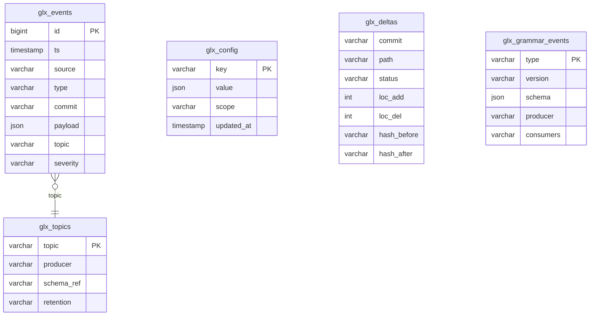

# 03 — EGDB: Event Grammar DB (ERD + schematy)

## ERD

%% Mermaid Styles
classDef tile fill:#0b7285,stroke:#083344,color:#fff;
classDef db fill:#4c6ef5,stroke:#233,color:#fff;
classDef guard fill:#e03131,stroke:#300,color:#fff;

## Schematy (JSON Schema)

- `glx_events`: `<!-- @auto:egdb.schema.events -->`
- `glx_deltas`: `<!-- @auto:egdb.schema.deltas -->`
- `glx_grammar_events`: `<!-- @auto:egdb.schema.grammar -->`
