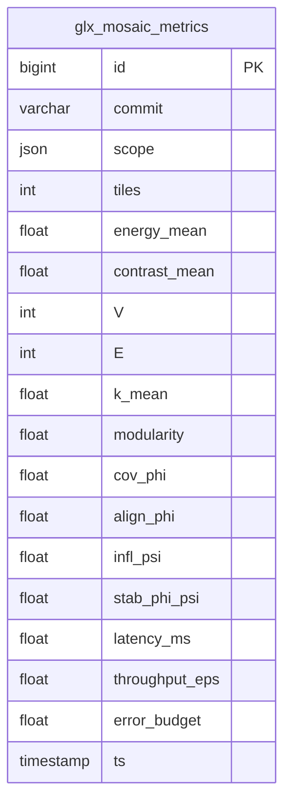

# 12 — Mosaic Metrics (Φ/Ψ) — **SZABLON**

> Szablon definicji metryk **Mozaiki** dla GlitchLab. Ten plik **nie analizuje** repo ani ZIP-ów.  
> Zapewnia strukturę pod automaty `@auto:` oraz zdarzenie `mosaic.metrics.ready`.

---

## Spis treści
1. [Cel i zakres](#cel-i-zakres)
2. [Model mozaiki (pojęcia wspólne)](#model-mozaiki-pojęcia-wspólne)
3. [Rodziny metryk](#rodziny-metryk)
   - [Tile-level](#tile-level)
   - [Region/Cluster-level](#regioncluster-level)
   - [Graph-level](#graph-level)
   - [Coupling Φ/Ψ (AST ⇄ Mosaic)](#coupling-φψ-ast--mosaic)
   - [Pipeline QoS](#pipeline-qos)
4. [Kontrakty danych (mosaic.metrics.ready)](#kontrakty-danych-mosaicmetricsready)
5. [Schemat bazy metryk](#schemat-bazy-metryk)
6. [Instrumentacja i publikacja](#instrumentacja-i-publikacja)
7. [Wizualizacje (placeholders)](#wizualizacje-placeholders)
8. [Nawigacja](#nawigacja)

---

## Cel i zakres

- Zmierzyć **strukturę** i **entropię/chaos** przetwarzania obrazów/kodu w GlitchLab.  
- Ujednolicić metryki wzdłuż pętli **Φ (mapowanie AST→Mosaic)** i **Ψ (feedback Mosaic→AST)**.
- Dostarczyć artefakty do **HUD** i do tabel EGDB (lub rozszerzeń) jako źródło prawdy.

**Powiązania:** [Pipelines (05)](pipelines.md) • [Obserwowalność (09)](observability.md) • [BUS (02)](bus.md)

---

## Model mozaiki (pojęcia wspólne)

Nie narzucając konkretnej implementacji, przyjmujemy wspólny słownik:

- **Tile** `T_i` — komórka mozaiki z nośnikiem `supp(T_i)` i wektorem cech `f_i ∈ ℝ^k`.
- **Sąsiedztwo** `N(i)` — zbiór indeksów sąsiadów (np. 4/8-neigh, hexa, TO-lattice).
- **Graf mozaiki** `G = (V, E)` — wierzchołki `V` ↔ tile, krawędzie `E` ↔ sąsiedztwa.
- **Mapa Φ** — funkcja odwzorowująca z AST do `G` (np. moduł→region, funkcja→subgraph).
- **Sprzężenie Ψ** — zwrotna aktualizacja AST na bazie atrybutów `G` (np. zalecenia REF).

**Uwaga:** Poniższe formuły są **szablonem**; wstaw wartości/definicje w miejscach **Δ**.

---

## Rodziny metryk

### Tile-level

- **Energia kafelka** `E_i = ||f_i||_2` *(lub Δ: inna norma)*  
- **Tekstura/lokalna złożoność** `τ_i = Δ` *(np. wariancja gradientów)*  
- **Kontrast sąsiedztwa** `C_i = (1/|N(i)|) Σ_{j∈N(i)} d(f_i, f_j)` *(d — Δ: metryka)*

**Placeholders do wstrzyknięcia**
```
<!-- @auto:mosaic.tile.metrics.table -->
```

---

### Region/Cluster-level

- **Spójność regionu** `σ(R) = 1 - (1/|R||N_R|) Σ_{(i,j)∈E_R} d(f_i, f_j)`  
- **Jednorodność klastra** `U(Cl) = Δ` *(np. Silhouette w przestrzeni cech)*  
- **Gęstość krawędzi w regionie** `ρ(R) = |E_R| / |R|`

```
<!-- @auto:mosaic.region.stats -->
```

---

### Graph-level

- **Rozmiar grafu** `|V|, |E|`  
- **Średni stopień** `⟨k⟩ = 2|E| / |V|`  
- **Modularność** `Q = Δ` *(np. wg Louvain/Leiden; definicja wstaw Δ)*  
- **Średnica / średnia długość ścieżki** `D, L = Δ`  
- **Spektrum Laplasjanu** `λ_2, …, λ_n = Δ` *(koneksja, „sztywność”)*

```
<!-- @auto:mosaic.graph.metrics -->
```

---

### Coupling Φ/Ψ (AST ⇄ Mosaic)

> Zawiera **kluczowe metryki sprzężenia** między kodem (AST) a obrazem (Mosaic).

- **Pokrycie Φ** `Cov_Φ = |M( AST_scope )| / |G|` *(procent wierzchołków objętych mapą)*  
- **Zgodność semantyczna** `Align_Φ = Δ` *(np. zgodność etykiet/tematów)*  
- **Wpływ Ψ** `Infl_Ψ = Δ` *(np. frakcja refactor items indukowanych przez Mosaic)*  
- **Stabilność pętli** `Stab_{ΦΨ} = 1 - Δ` *(np. wariancja metryk między iteracjami)*

**Zdarzenie wynikowe:** `mosaic.metrics.ready` (patrz [Kontrakty](#kontrakty-danych-mosaicmetricsready))

```
<!-- @auto:mosaic.coupling.table -->
```

---

### Pipeline QoS

- **Latency (end-to-end)** `T_e2e = t_publish - t_input`  
- **Throughput** `Θ = Δ` *(zdarzenia/s)*  
- **Error budget** `ε = Δ` *(odsetek fail-closed z VAL)*

```
<!-- @auto:mosaic.pipeline.qos -->
```

---

## Kontrakty danych (`mosaic.metrics.ready`)

**JSON (szablon):**
```json
{{
  "type": "mosaic.metrics.ready",
  "commit": "Δ",
  "scope": ["Δ"],
  "tile": {{
    "count": "Δ",
    "energy_mean": "Δ",
    "contrast_mean": "Δ"
  }},
  "graph": {{
    "V": "Δ",
    "E": "Δ",
    "k_mean": "Δ",
    "modularity": "Δ"
  }},
  "coupling": {{
    "cov_phi": "Δ",
    "align_phi": "Δ",
    "infl_psi": "Δ",
    "stab_phi_psi": "Δ"
  }},
  "qos": {{
    "latency_ms": "Δ",
    "throughput_eps": "Δ",
    "error_budget": "Δ"
  }}
}}
```

**JSON Schema (stub):** `schemas/mosaic.metrics.ready.schema.json`

---

## Schemat bazy metryk

> Możesz utrwalić metryki w osobnych tabelach lub w EGDB (rozszerzenie).



<!-- @auto:egdb.schema.glx_mosaic_metrics -->

---

## Instrumentacja i publikacja

1. Zbieraj metryki w `mosaic_metrics.json` (Δ: ścieżka artefaktu).  
2. Emituj `mosaic.metrics.ready` na **BUS** i publikuj przez **HUD** do EGDB.  
3. Wypełniaj znaczniki `@auto:` w dokumentach:  
   - `@auto:mosaic.tile.metrics.table`  
   - `@auto:mosaic.region.stats`  
   - `@auto:mosaic.graph.metrics`  
   - `@auto:mosaic.coupling.table`  
   - `@auto:mosaic.pipeline.qos`

---

## Wizualizacje (placeholders)

```mermaid
flowchart LR
  AST[AST scope] -->|Φ map| MZ[Mosaic Graph]
  MZ -->|Ψ feedback| AST
  MZ --> METRICS[(glx_mosaic_metrics)]

%% Mermaid Styles
classDef tile fill:#0b7285,stroke:#083344,color:#fff;
classDef db fill:#4c6ef5,stroke:#233,color:#fff;
classDef guard fill:#e03131,stroke:#300,color:#fff;


<!-- @auto:diagram:mosaic.heatmap -->
<!-- @auto:diagram:mosaic.graphview -->
<!-- @auto:diagram:mosaic.iteration_trend -->
```

---

## Nawigacja
- W górę: [index.md](index.md) • [Pipelines (05)](pipelines.md) • [Obserwowalność (09)](observability.md)
