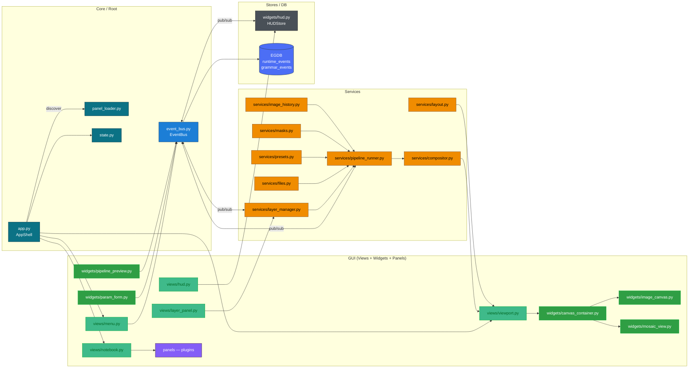
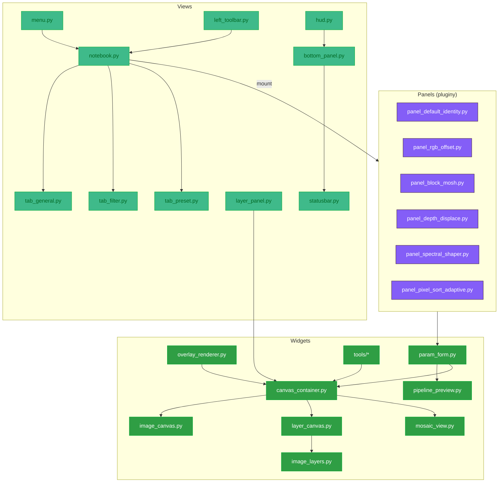
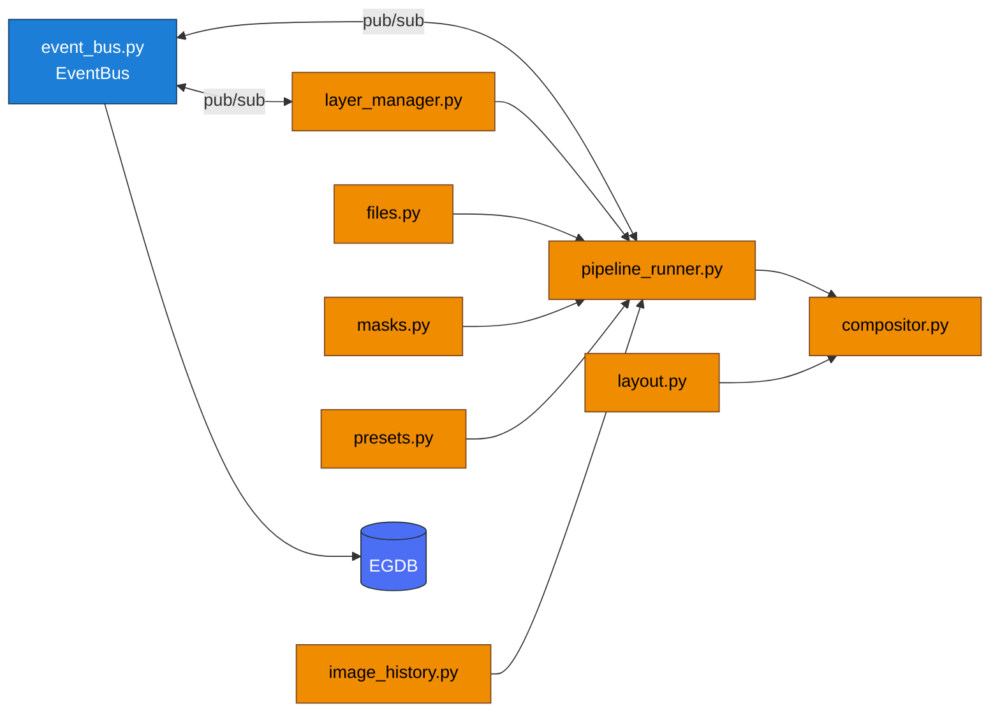
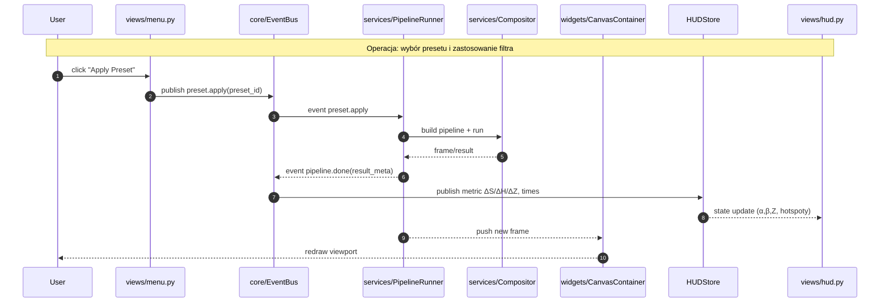

### A) Architektura GUI – widok makro (C4-ish)

---

### B) GUI – wewnętrzne przepływy (Views/Widgets/Panels)

---

### C) Services – zależności i punkty integracji

---

### D) Scenariusz: „Zastosuj preset → render na Canvas” (sequence)

## Co ten plan „zamyka” i gdzie go użyć

* **Pokrywa wszystkie warstwy:** *Core/Root → GUI (views/widgets/panels) → Services → Stores/EGDB*.
* **Oddaje realne zależności** z Twojego repo (m.in. `pipeline_runner`, `compositor`, `layer_manager`, `canvas_container`, `hud`).
* **Kanał zdarzeń BUS** jest jawny (pub/sub), a **HUDStore** i **EGDB** mają osobne węzły (brak krawędzi do subgrafów).
* **Gotowe do README.md/ARCHITECTURE.md** – bez walki z parserem GitHuba.

**Opis komponentów:**  
`<!-- @auto:gui.components -->`
