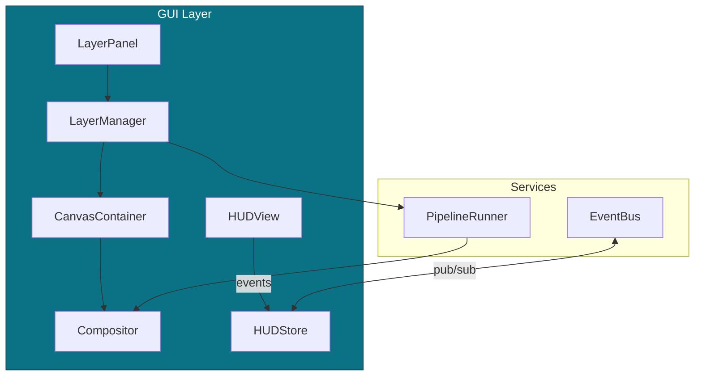

# 04 — Warstwa GUI (komponenty i przepływy)

%% Mermaid Styles
classDef tile fill:#0b7285,stroke:#083344,color:#fff;
classDef db fill:#4c6ef5,stroke:#233,color:#fff;
classDef guard fill:#e03131,stroke:#300,color:#fff;

**Opis komponentów:**  
`<!-- @auto:gui.components -->`
