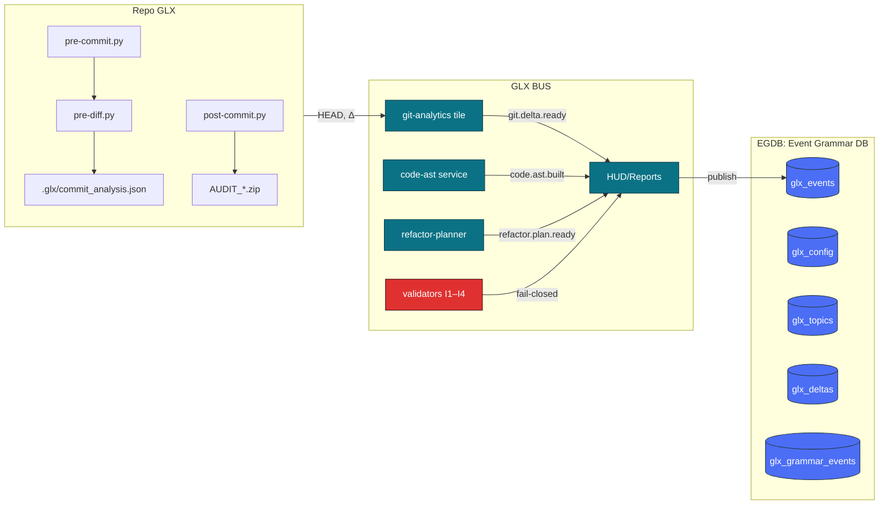

# GLX :: Katalog architektury — **HIPERTEKST v5**

> Zestaw plików **szablonowych** (bez analizy kodu). Każda sekcja ma znaczniki `@auto:` oraz symbol **Δ** do automatycznego wypełnienia przez narzędzia GLX.

---

## Spis części

1. **[01_repo.md](repo.md)** — Repo GLX (hooki, artefakty, AUDIT)  
2. **[02_bus.md](bus.md)** — GLX BUS (tiles, guards, HUD)  
3. **[03_egdb.md](egdb.md)** — Event Grammar DB (ERD + schematy)  
4. **[04_gui.md](gui.md)** — Warstwa GUI (komponenty, przepływy)  
5. **[05_pipelines.md](pipelines.md)** — Filters / Analysis / Mosaic (Φ/Ψ)  
6. **[06_ci_ops.md](ci_ops.md)** — CI/Ops i cykl commitu (sekwencja)  
7. **[07_contracts.md](contracts.md)** — Kontrakty danych (JSON Schema)  
8. **[08_validation.md](validation.md)** — Reguły walidacji I1–I4  
9. **[09_observability.md](observability.md)** — Obserwowalność/HUD metryki  
10. **[10_attachments.md](attachments.md)** — Załączniki, tagi automaty 
11. **[GLX_Mosaika_Matematyka_v1.md](GLX_Mosaika_Matematyka_v1.md)** - Matematyka i Formalizm Mozaiki
11. **[NAV](#nawigacja-szybka)** — szybkie przejścia

---

## Mapa systemu (HLD)

**Dowiązania:** [Repo](repo.md) • [BUS](bus.md) • [EGDB](egdb.md) • [GUI](gui.md) • [Pipelines](pipelines.md) • [CI/Ops](ci_ops.md)

---

## Nawigacja szybka
- **Repo:** [Hooki](repo.md#hooki) • [.glx](repo.md#glxcommitanalysisjson) • [AUDIT](repo.md#audit_)
- **BUS:** [GA](bus.md#git-analytics-tile) • [AST](bus.md#code-ast-service) • [REF](bus.md#refactor-planner) • [VAL](bus.md#validators-i1i4) • [HUD](bus.md#hudreports)
- **EGDB:** [ERD](egdb.md#erd) • [Schematy](egdb.md#schematy-json-schema)
- **GUI:** [Komponenty](gui.md#komponenty) • [Przepływy](gui.md#przepływy)
- **Pipelines:** [Filters](pipelines.md#filters) • [Φ/Ψ](pipelines.md#φψ)
- **CI/Ops:** [Sekwencja](ci_ops.md#sekwencja)
- **Contracts:** [Eventy](contracts.md#kontrakty-danych-json-schema)
- **Validation:** [I1–I4](validation.md#reguły-walidacji-i1i4)
- **Observability:** [HUD](observability.md#metryki)
